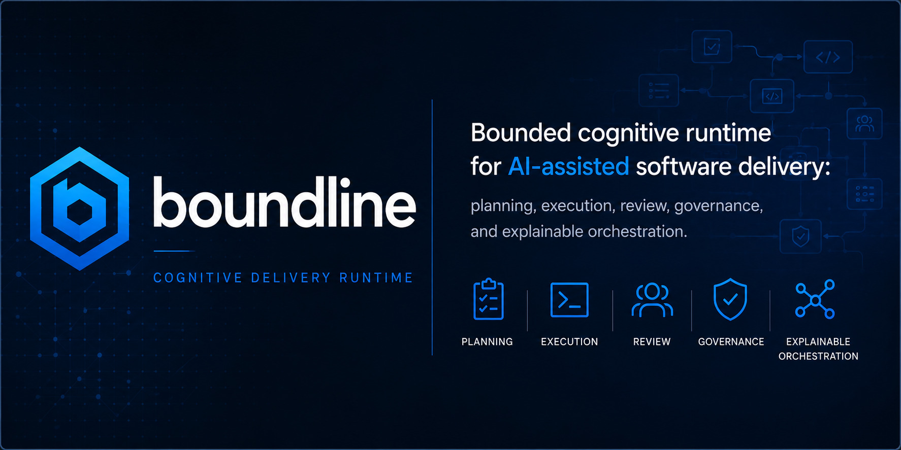

# Boundline


[](https://github.com/apply-the/boundline/releases)
[](LICENSE)
[](https://github.com/apply-the/boundline/actions/workflows/ci.yml)
[](https://github.com/apply-the/boundline/actions/workflows/lint.yml)
[](https://github.com/apply-the/boundline/actions/workflows/vulnerabilities.yml)
[](https://codecov.io/gh/apply-the/boundline)
[](https://sonarcloud.io/summary/new_code?id=apply-the_boundline)

**The local delivery orchestrator for bounded engineering work.** Turn goals into executed plans safely, without losing control to an opaque AI loop.

## 🚀 Why Boundline?

- 🎯 **Goal-Driven Execution:** Translates high-level objectives into concrete, step-by-step technical plans.
- 💾 **Session-Based State:** Maintains explicit, resumable session state locally on disk. You are never hostage to ephemeral chat memory.
- 🛑 **Safe Delivery:** Executes steps safely using your repository's existing constraints and Canon governance rules.
- 📝 **Explicit Traces:** Never lose context. Every execution step is recorded in local, auditable traces.
- 🔌 **Agnostic Architecture:** Seamlessly plugs into external frameworks and capability providers.

## 🧠 How it Works

Boundline forces an explicit, inspectable workflow:
1. `goal` -> Record the objective for the active session.
2. `plan` -> Draft the bounded work from the repository evidence.
3. `run` -> Execute the next approved step.
4. `inspect` -> Report the authoritative runtime state.

In the 0.72.0 release, `plan` enforces the full planning-readiness chain before
execution handoff: goal quality, plan quality, backlog quality, then planning
analysis. Planning analysis is a read-only coherence gate across the active
goal, plan outcomes, validation strategy, Canon backlog packet, execution
handoff, and governed evidence already present in the session. If Canon only
produced a closure-limited backlog packet, if a selected slice contradicts the
sequencing plan, or if execution readiness still depends on missing governed
evidence, Boundline stops on one explicit planning gate and keeps the session
non-terminal until the missing evidence is repaired.

The same release also hardens large-codebase context admission. Planning now
projects typed context-pack entries, omission findings, repository-map
readiness, digest-backed compaction, snapshot-cache freshness, and patch-safe
large-file edit constraints instead of silently widening context reads.

The same line also adds the first native external capability-provider protocol.
Operators now register providers explicitly, satisfy setup requirements before
activation, dry-run readiness before use, and keep provider output
non-authoritative until Boundline validates the returned evidence or rejects
the proposal.

## Installation

### Ubuntu / Debian (APT)

We provide official `.deb` packages for `amd64` and `arm64` via the Apply The APT repository. 

To install or update Boundline without needing Rust, run:

```bash
curl -fsSL https://apply-the.github.io/packages/apt/gpg.key \
  | sudo gpg --dearmor -o /usr/share/keyrings/apply-the-archive-keyring.gpg

echo "deb [signed-by=/usr/share/keyrings/apply-the-archive-keyring.gpg] https://apply-the.github.io/packages/apt stable main" \
  | sudo tee /etc/apt/sources.list.d/apply-the.list

sudo apt update
sudo apt install boundline
```

**Post-install verification:**
```bash
boundline --version
boundline doctor --install
```

### GitHub Releases Fallback
If you prefer not to use the APT repository, you can download the `.deb` files directly from the [GitHub Releases](https://github.com/apply-the/boundline/releases) page and install them manually:
```bash
sudo dpkg -i boundline_<version>_<arch>.deb
```

### Source Install Fallback (Requires Rust)
If you are developing Boundline or using an unsupported architecture, you can build from source:
```bash
cargo install --path .
```

## Quick Start

```bash
boundline doctor --install
cd my-project
boundline init --assistant codex --route planning=copilot:gpt-4o
boundline goal --goal "Fix the failing add test"
boundline plan
boundline run
```

For a local Ollama-first workspace, install Ollama, pull the preset models,
then let init pin every delivery slot:

```bash
ollama pull qwen2.5:7b
ollama pull qwen2.5-coder:7b
boundline init --ollama-profile small
```

The built-in Ollama profiles are:

| Profile | Target machine | Planning and run | Verification and review |
|---|---|---|---|
| `small` | Apple Silicon with 16 GB unified memory | `qwen2.5-coder:7b` | `qwen2.5:7b` |
| `medium` | local workstation with 64 GB memory | `qwen2.5-coder:14b` | `qwen2.5:14b` |
| `large` | local workstation with 96/128 GB memory | `qwen2.5-coder:32b` | `qwen2.5:72b` |

## Use Boundline from chat

Install the assistant pack for your host with `boundline init --assistant <host>` or
`boundline assistant install --host <host> --scope user`, then drive the same
session-native lifecycle from chat. Use `/boundline:init` for global bootstrap,
`/boundline:continue` when you need the runtime-owned follow-up, and repo-local
session commands once the workspace is initialized. The assistant surface should keep
`.boundline/session.json` authoritative, surface the runtime `next_command`, and
stop cleanly on blocked, clarification-required, failed, exhausted, and terminal
states instead of inventing parallel workflow state.

## Use Boundline from CLI

The CLI remains the source of truth for repo state and delivery progress. Use
`boundline doctor --install` to verify the local runtime, `boundline init` to
bootstrap a workspace, then run `boundline goal`, `boundline plan`,
`boundline run`, `boundline status`, `boundline next`, and
`boundline inspect` as the bounded session advances.

When local semantic retrieval is enabled, manage the derived evidence index
explicitly with `boundline index status`, `boundline index refresh`,
`boundline index rebuild`, `boundline index clean`, and
`boundline index doctor`. The derived SQLite store and manifest under
`.boundline/context-intelligence/` remain disposable workspace-local runtime
state rather than Git-merge artifacts.

Boundline also supports one explicit framework adapter per workspace when you
need framework-owned stage execution without giving up the built-in default
path. Register the shipped Speckit profile with
`boundline adapter add speckit --workspace <workspace>`, inspect the active
selection with `boundline adapter show --workspace <workspace>` or
`boundline adapter show --workspace <workspace> --json`, and remove it again
with `boundline adapter remove --workspace <workspace>`.

The adapter inspection report is the operator-facing compatibility surface. It
shows the adapter ID, compatibility line, supported Boundline version range,
declared supported transports, stage overrides, hook subscriptions, and the
current config-completeness state before `plan` or `run` tries to hand off a
stage.

For the shipped Speckit profile, the corrected ownership map is explicit:
`goal` stays Boundline-native, `plan` maps to workflow ID
`speckit-planning`, `run` maps to workflow ID `speckit-implementation`, and
`status` plus `inspect` remain Boundline-owned visibility surfaces over the
adapter's stage outcomes. The split workflow assets live under
`.specify/workflows/speckit/planning.yml` and
`.specify/workflows/speckit/implementation.yml`, while the adapter response
still reports the semantic workflow IDs instead of the file paths used to
launch the real Speckit CLI.

That stage map also defines the command boundary. A claimed `plan` stage must
run the Speckit planning lifecycle and finish with a mandatory
`speckit.analyze` readiness gate. One claimed plan attempt may use one initial
analyze pass plus at most two remediation or analyze re-check cycles before it
must return `blocked` with the remaining findings. A claimed `run` stage is
implementation-only by design: it invokes `speckit.implement` plus validation
or status capture and must not rerun planning commands.

Adapter execution in V1 stays intentionally bounded: one trusted local
subprocess, one-shot JSON over stdin/stdout, the same standard success or error
envelope on stdout for every command, optional structured stderr captured only
as trace enrichment, and no graceful-shutdown or long-lived daemon lifecycle.

External capability providers stay separate from framework adapters. Use the
provider surface when you want one bounded capability source with explicit
permissions, setup, health, and evidence handling:

```bash
boundline provider add local-demo --workspace <workspace> --command python3 --arg scripts/provider.py
boundline provider show --workspace <workspace> --json
boundline provider health --workspace <workspace>
boundline provider remove local-demo --workspace <workspace>
```

Provider-backed execution remains subordinate to Boundline runtime policy. The
runtime owns permission admission, phase support, failure classification,
accepted-versus-rejected evidence refs, and any stop condition surfaced
through `status`, `inspect`, or traces.

## How chat commands map to CLI/runtime state

Chat command packs are thin wrappers over the Rust runtime. `/boundline:goal`,
`/boundline:plan`, `/boundline:run`, `/boundline:status`, `/boundline:next`, and
`/boundline:inspect` should map directly to the corresponding CLI commands and the
same persisted session and trace state under `.boundline/session.json` and
`.boundline/traces/`. Chat history is advisory only; the CLI runtime and its
persisted outputs remain authoritative.

The primary product story is session-native: start a session with `goal`, shape
it with `plan`, and continue with `run`, `status`, `next`, and `inspect`.
Manifest-backed execution remains available as an explicit compatibility path
when the operator deliberately asks for `--compatibility`.

## 🛠️ Key Commands

| Command | What it does |
|---|---|
| `boundline goal` | Set the objective for the current session. |
| `boundline plan` | Generate a technical plan to achieve the goal. |
| `boundline run` | Execute the next pending step in the plan. |
| `boundline status` | Check the current session status and next actions. |
| `boundline inspect` | View detailed execution traces and evidence. |
| `boundline index status` | Report manifest-backed derived-index lifecycle state. |
| `boundline index doctor` | Diagnose tracked, stale, corrupt, or degraded derived-index state. |

## 📚 Deep Dive Documentation

- [Getting Started](tech-docs/getting-started.md)
- [Configuration and Precedence](tech-docs/configuration.md)
- [Architecture and Canon Boundaries](tech-docs/architecture.md)
- [Project Scale Delivery Model](tech-docs/delivery-model.md)
- [Assistant Command Packs](assistant/README.md)

## 🤝 Community And Support
- Bug reports & feature requests: `.github/ISSUE_TEMPLATE/`
- Vulnerability reporting: [SECURITY.md](SECURITY.md)
- Participation expectations: `.github/CODE_OF_CONDUCT.md`
- Contributor workflow: [CONTRIBUTING.md](CONTRIBUTING.md)
