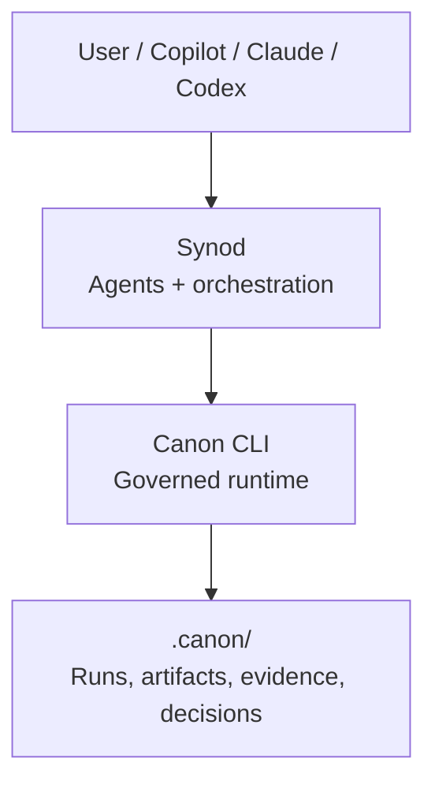

# synod

Synod is a delivery orchestrator built on top of Canon. Its core job is to turn
bounded engineering intent into working code through controlled, inspectable
execution. Advanced strategy layers such as councils or provider-routing
complexity may arrive later, but they are not the baseline identity of the system.

Canon is not the brain. Canon is the governed ledger and contract engine that Synod uses to make runs auditable, traceable, and reproducible.

## Separation

- Synod: bounded task orchestration, agent and tool coordination, retries,
  replanning, execution loops, and developer-facing traceability.
- Canon: governed runs, policy and approval gates, artifact contracts, input snapshots, evidence, decision logs, and persistence.

Canon does not orchestrate agents or decide strategy. It enforces how work is recorded and validated.

## Current Build Priorities

For current Synod feature work, the priority order is:

1. execution
2. orchestration
3. decomposition
4. validation
5. optimization
6. polish

Current specs normally defer councils, provider abstraction complexity,
distributed agent systems, long-term memory, UI or UX work, and deployment
pipelines until they are explicitly reprioritized.

## Architecture



## Runtime Flow

1. Synod receives a task and selects strategy, agents, and providers.
2. Synod opens a governed run in Canon with risk, zone, and ownership.
3. Agents read inputs and write contract-shaped outputs into Canon artifacts.
4. Canon validates, applies gates, and persists evidence and decisions.
5. Synod continues review, execution, and iteration until completion.

## Design Principle

Canon stays stable as the contract and source of truth. Synod evolves quickly as the intelligence and orchestration layer on top.

## Implemented Core

The current repository implements the delivery orchestrator core as a Rust library crate.

- `synod::Orchestrator`: runs one bounded task through a sequential execution loop.
- `synod::StaticPlanner`: provides deterministic initial plans and queued replans for tests.
- `synod::AgentRegistry` and `synod::ToolRegistry`: register named execution endpoints.
- `synod::FileTraceStore`: persists execution traces under `<workspace>/.synod/traces/`.
- `synod::TaskRunRequest` and `synod::TaskRunResponse`: define the run contract used by tests and future delivery flows.

The current implementation covers:

- explicit bounded task lifecycle
- shared task context across steps
- bounded retries and bounded replanning
- deterministic terminal states
- persisted JSON traces for successful and non-successful runs

## Local Validation

Run these commands from the repository root:

```bash
cargo fmt --all
cargo clippy --all-targets --all-features -- -D warnings
cargo test --all-targets
```
