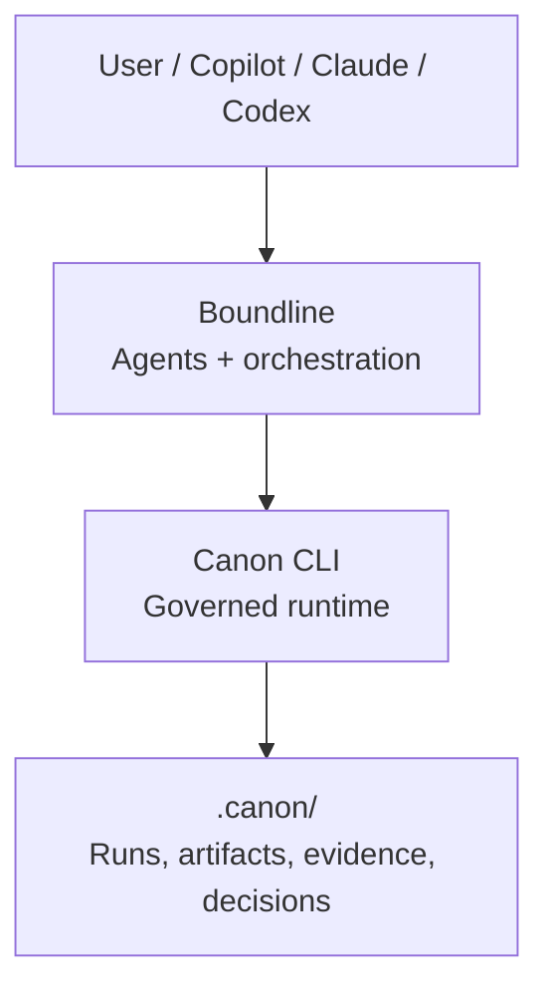

# Boundline


[](https://github.com/apply-the/boundline/actions/workflows/ci.yml)
[](https://github.com/apply-the/boundline/actions/workflows/lint.yml)
[](https://github.com/apply-the/boundline/actions/workflows/vulnerabilities.yml)
[](https://codecov.io/gh/apply-the/boundline)

**Boundline is a local delivery orchestrator for bounded engineering work.** It
decides what to do next, executes bounded work, validates outcomes, keeps the
authoritative session state, and exposes the same story through `run`,
`status`, `next`, and `inspect`. Canon is optional and secondary: it only
enters when you deliberately want governed stages, approvals, or governed
artifacts.

## Quick Path Brutale

Install Boundline through the release-aligned channel that matches your machine,
then verify the Boundline plus Canon pairing before touching workspace state.

### Install

- macOS via Homebrew formula once the release bundle checksums are published:

```bash
brew install https://raw.githubusercontent.com/apply-the/boundline/v0.39.0/distribution/homebrew/Formula/boundline.rb
```

- Windows via winget after the release manifest is published:

```powershell
winget install ApplyThe.Boundline
```

- Source fallback when you are outside the official bundled channels:

```bash
git clone https://github.com/apply-the/boundline.git
cd boundline
cargo install --path .
```

### Verify The Install

```bash
boundline doctor --install
```

You should see the running Boundline version, the documented Canon support target,
the candidate install channels for the current machine, and one explicit
pairing state: `ready`, `already_satisfied`, `blocked`, or `repair_needed`.

### Run The First Bounded Session

```bash
boundline doctor --workspace <workspace>
boundline start --workspace <workspace>
boundline capture --workspace <workspace> --goal "Fix the failing add test"
boundline plan --workspace <workspace>
boundline plan --workspace <workspace> --confirm
boundline run --workspace <workspace>
boundline status --workspace <workspace>
```

`boundline init` remains optional. Use it only when you want scaffolded
compatibility/bootstrap files, assistant setup, or seeded domain-template
defaults before the session-native path starts.

The primary product story stays explicit: `session-native: start a session -> capture a goal -> plan -> confirm -> run -> status -> inspect`.
Declarative `.boundline/execution.json` execution remains available as an explicit compatibility path when you intentionally need the manifest-backed route.

## Read This In Two Layers

- Quick path: this README plus [docs/getting-started.md](docs/getting-started.md)
- Advanced architecture: [docs/architecture.md](docs/architecture.md)
- Assistant-specific command packs: [assistant/README.md](assistant/README.md)

Stop after the quick path if all you need is install, verify, and run.
Continue into the advanced architecture doc only when you need deeper routing,
workflow, cluster, compatibility, or governance detail.

## What Boundline Owns

The main surface is the `boundline` CLI:

- `doctor --install` verifies the installed Boundline plus Canon pairing.
- `doctor --workspace` verifies that a target repository is ready for bounded work.
- `init` optionally bootstraps `.boundline` files, assistant setup, and domain defaults.
- `config` shows, sets, and unsets routing defaults, capability policy, effort policy, and domain-template settings.
- `start`, `capture`, `flow`, `plan`, and `step` drive the session-native workflow.
- `run` executes the bounded delivery task, preferring native session planning when a `GoalPlan` exists.
- `status`, `next`, and `inspect` explain the current session, follow-through, route ownership, and bounded evidence.
- `workflow list|run|status|resume|inspect` adds named entrypoints over the same session-owned runtime instead of creating a second runtime.

## Boundline And Canon

Boundline is the product and orchestration owner. Canon is the governed runtime
Boundline can reuse for policy gates, approvals, structured artifacts, and evidence
capture. Boundline still owns the operator journey, session state, bounded
planning, execution, and validation.

The current Boundline adapter documents Canon `0.39.0` support on the machine-facing
`canon governance start|refresh|capabilities --json` `v1` adapter surface.
That version note is about the Canon CLI compatibility target only; it does not
turn Canon into the orchestrator.

## Distribution Surface

- Homebrew formula source of truth: `distribution/homebrew/Formula/boundline.rb`
- winget manifest source of truth: `distribution/winget/manifests/a/ApplyThe/Boundline/0.39.0/`
- Release bundles source of truth: `.github/workflows/release-distribution.yml`
- Bundle policy source of truth: `distribution/canon-bundle.toml`
- Source fallback remains supported when the bundled channels are unavailable or still waiting on external channel publication

For contributor setup and validation expectations, see [CONTRIBUTING.md](CONTRIBUTING.md).

## Advanced Architecture

If you want the deeper product model, continue below or jump straight to
[docs/architecture.md](docs/architecture.md). The rest of this README is the
longer architecture-oriented explanation, not the first-run guide.

### Advanced Configuration And Cluster Examples

Optional routing setup:

```bash
boundline config set --scope global --slot planning --runtime codex --model gpt-5-codex
boundline config set --workspace <workspace> --scope workspace --reviewer safety --runtime copilot --model gpt-5.4
boundline config set-domain --workspace <workspace> --scope workspace --family react --enable --standards "follow the shared UI system"
boundline config bind-context --workspace <workspace> --scope workspace --family react --kind design-system --reference mcp:design-system --required
boundline config show --workspace <workspace> --scope effective
```

The effective view now reports the resolved slot route, its authority source,
the assistant binding implied by that route, and any effective domain-template
guidance so backend ownership plus domain-specific standards are clear before
execution starts.

Optional clustered setup across two repositories:

```bash
boundline cluster init \
	--workspace <primary-workspace> \
	--cluster-id delivery-a \
	--member <primary-workspace> \
	--member <secondary-workspace>

boundline cluster status --workspace <primary-workspace>
boundline config set --cluster <primary-workspace> --scope cluster --slot planning --runtime codex --model gpt-5-codex
boundline config show --workspace <secondary-workspace> --cluster <primary-workspace> --scope effective
```

Session-native clustered delivery keeps the primary workspace authoritative:

```bash
boundline start --cluster <primary-workspace>
boundline capture --cluster <primary-workspace> --goal "Fix the failing add test"
boundline plan --cluster <primary-workspace>
boundline run --cluster <primary-workspace>
boundline status --cluster <primary-workspace>
boundline inspect --cluster <primary-workspace>
```

### 2. Run the session workflow

```bash
boundline doctor --workspace <workspace>
boundline start --workspace <workspace>
boundline capture --workspace <workspace> --goal "Fix the failing add test"
# or capture from one or more Markdown brief files inside the workspace:
boundline capture --workspace <workspace> --brief docs/brief.md
# optional explicit flow selection still exists:
boundline flow bug-fix --workspace <workspace>
# or confirm/override during planning:
# boundline plan --workspace <workspace> --flow bug-fix
# boundline plan --workspace <workspace> --no-flow
boundline plan --workspace <workspace>
boundline plan --workspace <workspace> --confirm
boundline run --workspace <workspace>
boundline status --workspace <workspace>
boundline inspect --workspace <workspace>
```

When the change spans a registered cluster, enter the same session-native flow
through the primary workspace instead of switching ownership to a member:

```bash
boundline start --cluster <primary-workspace>
boundline capture --cluster <primary-workspace> --goal "Fix the failing add test"
boundline plan --cluster <primary-workspace>
boundline plan --cluster <primary-workspace> --confirm
boundline run --cluster <primary-workspace>
boundline status --cluster <primary-workspace>
boundline inspect --cluster <primary-workspace>
```

What those commands do, in short:

- `doctor` checks that the workspace and execution manifest are usable.
- `start` initializes the workspace session.
- `capture` stores human-authored goal and brief input in session state and persists `negotiation_goal_summary`, `negotiation_resolution`, and `negotiation_acceptance_boundary`.
- `flow` optionally selects `bug-fix`, `change`, or `delivery` ahead of planning.
- `plan` derives the next bounded `GoalPlan` from captured input plus workspace state only when the negotiated packet is credible, the bounded context is explicit enough, and any active domain template still matches the selected target with required inputs available.
- `plan --confirm` confirms the current proposal so native execution can continue.
- `run` executes through the native session route whenever a `GoalPlan` exists; governed `bug-fix:investigate` and later verify-stage Canon `security-assessment` can stay on that same route, while declarative `.boundline/execution.json` execution remains the explicit compatibility path.
- `status` reports the current session snapshot with explicit `routing`, `execution_condition`, negotiation summary, next-step guidance, and clustered authority or participation cues when the run spans a registered cluster.
- `inspect` summarizes the latest trace and evidence with the same route, negotiation, and execution-condition story plus trace-specific cluster detail.

Optional named workflow layer:

```bash
boundline workflow list --workspace <workspace>
boundline workflow run governed-delivery --workspace <workspace> --goal "Fix the failing add test"
boundline workflow status --workspace <workspace>
boundline workflow resume --workspace <workspace>
boundline workflow inspect --workspace <workspace>
```

`boundline workflow run` reuses the same session-native runtime. It persists named
workflow progress in the active session and reports the same `routing`,
`execution_condition`, and `next_command` story as the direct session commands.
Use `workflow list` first when the workspace offers multiple named workflows or
when an assistant needs discovery guidance instead of reading the raw registry.

### 3. Use direct run natively, or opt into compatibility explicitly

If you want one command to capture, plan, and run on the primary session-owned
route, call `run` directly with a workspace and goal:

```bash
boundline run --workspace <workspace> --goal "Fix the failing add test"
```

This native-first path does not require `.boundline/execution.json`. It bootstraps a
safe session, reuses negotiated delivery capture, creates one evidence-driven
proposal, confirms it for the direct-run bootstrap, and leaves the same
persisted native follow-up story behind for `status`, `next`, and `inspect`.

If you intentionally want the execution-profile path instead, opt in
explicitly:

```bash
boundline run --workspace <workspace> --compatibility --goal "Fix the failing add test"
```

In `0.38.0`, the explicit compatibility path still carries the negotiated delivery
summary into `run` and `inspect` so `negotiation_goal_summary`,
`negotiation_resolution`, and `negotiation_acceptance_boundary` stay visible
even when the authoritative follow-up state comes from an explicit
compatibility trace, and the persisted `effective_routing` plus
`assistant_bindings`, `runtime_capabilities`, and `slot_effort_policies`
snapshot remain inspectable after later config changes. The
same inspect path now reuses trace evidence to emit one bounded follow-through
story instead of leaving operators to infer the next action from raw decision
or failure lines alone. When governance reuses or rejects a Canon packet, the
same follow-through path can also surface compact Canon-grounded memory,
including artifact-backed provenance, stale-memory reasoning, and
`governance_next_action`.

If the execution profile includes an `adaptive` block, failed validation can
re-rank the next bounded candidate from the latest validation evidence without
leaving the manifest-declared `read_targets` set. In `0.28.0`, that bounded
repair path can also choose broader local families such as
`ordering_boundary_flip`, `result_status_flip`, and `numeric_literal_flip`,
surfaces the selected `candidate_family` plus credibility and rejection
reasons, and stops explicitly when the validation evidence is absent or too
weak to justify another materially different bounded attempt.

After an explicit compatibility run, `boundline status --workspace <workspace>` and
`boundline next --workspace <workspace>` remain usable even when no active session
exists. In that case Boundline now reports `continuity_authority:
compatibility_trace`, an inspect-only compatibility follow-up, and
`next_command: boundline inspect --workspace <workspace>` so the operator can keep
working from the latest workspace trace without guessing.

### 4. Inspect what happened

Boundline writes:

- session state to `<workspace>/.boundline/session.json`
- traces to `<workspace>/.boundline/traces/`
- latest execution evidence to the CLI output of `run`, `status`, `next`, and `inspect`

Depending on the manifest, that output can also include:

- route explanation, `execution_condition`, and CLI-reported next-command guidance
- `negotiation_goal_summary`, `negotiation_resolution`, and `negotiation_acceptance_boundary` when capture or planning negotiated the bounded delivery story
- `continuity_authority`, compatibility follow-up mode, and inspect-only workspace guidance after explicit compatibility runs that do not leave a resumable session
- `cluster_route_owner`, `cluster_authoritative_workspace`, `cluster_execution_condition`, participating workspaces, and any blocking workspace when a registered cluster owns the run
- changed files and validation status
- adaptive workspace-slice selection, `candidate_family`, selection reason,
  rejected candidates, explicit exhaustion reason, and attempt lineage
- review triggers, findings, votes, and outcomes
- governance runtime, mode, approval state, packet provenance, and blocked rationale

## Common Workflow

- run `boundline init --workspace <workspace>`
- optionally add `--template change` or `--template delivery` when you want a different starting profile than the default `bug-fix`
- optionally tune defaults with `boundline config show|set|unset`
- run `boundline doctor --workspace <workspace>`
- capture a goal with `boundline capture`
- optionally select `bug-fix`, `change`, or `delivery` with `boundline flow`, or let `boundline plan` infer the flow from evidence
- run `boundline plan`, confirm the proposal with `boundline plan --confirm` when required, then run `boundline run` for the native session path
- use direct `boundline run --workspace <workspace> --goal ...` when you want Boundline to bootstrap the native session path in one command
- add `--compatibility` to direct `run --goal` only when you intentionally want execution-profile behavior
- inspect the result with `boundline status`, `boundline next`, and `boundline inspect`

## Documentation

Start here if you want more than the short README flow:

- **[Getting Started](docs/getting-started.md)**: install Boundline, prepare a workspace, run the first task, then inspect the result
- **[Configuration](docs/configuration.md)**: init templates, routing precedence, and review-role routing
- **[Adaptive Execution](docs/adaptive-execution.md)**: adaptive execution manifest and replanning behavior
- **[Review Voting](docs/review-voting.md)**: review councils and vote resolution
- **[Assistant Command Packs](assistant/README.md)**: assistant command packs for Copilot, Codex, Claude, and Gemini CLI
- **[Changelog](CHANGELOG.md)**: released versions and delivered feature slices

## Separation

- Boundline: bounded task orchestration, agent and tool coordination, retries,
  replanning, execution loops, and developer-facing traceability.
- Canon: governed runs, policy and approval gates, artifact contracts, input snapshots, evidence, decision logs, and persistence.

Canon does not orchestrate agents or decide strategy. It enforces how work is recorded and validated.

## Current Build Priorities

For current Boundline feature work, the priority order is:

1. execution
2. orchestration
3. decomposition
4. validation
5. optimization
6. polish

Current specs normally defer councils, provider abstraction complexity,
distributed agent systems, long-term memory, UI or UX work, and deployment
pipelines until they are explicitly reprioritized.

## Long-term Architecture



## Long-term Runtime Flow

1. Boundline receives a task and selects strategy, agents, and providers.
2. Boundline opens a governed run in Canon with risk, zone, and ownership.
3. Agents read inputs and write contract-shaped outputs into Canon artifacts.
4. Canon validates, applies gates, and persists evidence and decisions.
5. Boundline continues review, execution, and iteration until completion.

## Design Principle

Canon stays stable as the contract and source of truth. Boundline evolves quickly as the intelligence and orchestration layer on top.

## Implemented Core

The current repository implements the delivery orchestrator core as a Rust library crate plus a local CLI binary.

- `boundline::Orchestrator`: runs one bounded task through a sequential execution loop.
- `boundline::StaticPlanner`: provides deterministic initial plans and queued replans for tests.
- `boundline::AgentRegistry` and `boundline::ToolRegistry`: register named execution endpoints.
- `boundline::FileTraceStore`: persists execution traces under `<workspace>/.boundline/traces/`.
- `boundline::FileSessionStore` and `boundline::SessionRuntime`: persist and resume active session state under `<workspace>/.boundline/session.json`, with clustered delivery keeping the authoritative session in the primary workspace while member workspaces persist their own terminal traces.
- `boundline::FileConfigStore` and configuration-domain types: persist global and workspace routing defaults with explicit source precedence.
- `boundline::ReviewProfile` and related review-domain types: configure bounded councils, reviewer findings, voting, and optional adjudication from `.boundline/execution.json`.
- `boundline::TaskRunRequest` and `boundline::TaskRunResponse`: define the run contract used by tests and future delivery flows.
- `boundline` CLI binary: exposes `init`, `config`, `doctor`, `start`, `capture`, `flow`, `plan`, `step`, `run`, `status`, `next`, and `inspect` over the existing core.

The current implementation covers:

- explicit bounded task lifecycle
- persisted workspace-scoped active sessions, including primary-owned clustered sessions with member-local traces
- shared task context across steps
- bounded retries and bounded replanning
- deterministic terminal states
- persisted JSON traces for successful and non-successful runs
- bounded review councils with manifest-driven reviewers, vote resolution, and optional adjudication
- bounded adaptive execution with workspace-slice selection, validation-guided slice reselection, deterministic local candidate synthesis, and signature-based replanning
- review evidence projected into `run`, `status`, `next`, and `inspect`
- clustered delivery authority, participation, blocking, and inspectable member-trace handoff under one primary session owner

## Developer CLI

The local `boundline` binary keeps the developer experience local, deterministic,
and backed by both `<workspace>/.boundline/session.json` and
`<workspace>/.boundline/traces/`. `boundline init` scaffolds the workspace execution
profile at `<workspace>/.boundline/execution.json` only for the explicit compatibility path, and `boundline config` manages
global and workspace routing defaults.

Direct `boundline run --workspace <workspace> --goal ...` now bootstraps the native
session route by default. Add `--compatibility` only when the manifest-backed
execution path is the deliberate choice.

The primary init + session flow is:

1. `boundline init --workspace <workspace>`
2. optional: if you want a non-default starting profile, rerun or start with `--template change|delivery`
3. optional: `boundline config show|set|unset`
4. `boundline start`
5. `boundline capture --goal "..."`
6. optional: `boundline flow bug-fix|change|delivery`
7. `boundline plan`
8. `boundline step` or `boundline run`
9. `boundline status`, `boundline next`, and `boundline inspect --workspace <workspace>`

When a flow is selected, `status` and `next` surface `active_flow`,
`current_stage`, and `stage_progress`. `run` and `inspect` also render flow and
stage lifecycle events such as flow selection, stage transitions, stage retry,
stage replan, and stage failure. Delivery runs additionally expose
`changed_files`, validation summaries, and trace-visible recovery history.
When a review profile is configured and triggered, `run`, `status`, `next`, and
`inspect` also expose the active review trigger, reviewer findings, vote
summary, and final review outcome. When adaptive execution is active, `run`,
`status`, `next`, and `inspect` also surface the latest `workspace_slice`,
selection headline, `candidate_family`, selection reason, rejected candidates,
validation outcome, explicit exhaustion reason when bounded recovery stops, and
attempt lineage, including validation-guided slice changes on the explicit
compatibility path.

For the full command walkthrough and example flows, see
[`specs/004-session-model-unification/quickstart.md`](specs/004-session-model-unification/quickstart.md)
and
[`specs/005-delivery-flows/quickstart.md`](specs/005-delivery-flows/quickstart.md),
and
[`specs/006-execution-engine/quickstart.md`](specs/006-execution-engine/quickstart.md),
and
[`specs/007-multi-agent-review/quickstart.md`](specs/007-multi-agent-review/quickstart.md).

For the adaptive execution manifest shape and bounded compatibility behavior in
the current release, see [`docs/adaptive-execution.md`](docs/adaptive-execution.md).

For the concrete review configuration and voting rules still available in
`0.17.0`, see [`docs/review-voting.md`](docs/review-voting.md).

In `0.38.0`, native planning and follow-through can also project
`context_summary`, `context_credibility`, `context_primary_inputs`,
`context_provenance`, and `context_staleness_reason` through `run`, `status`,
`next`, `inspect`, and the workflow-aware surfaces. The same read-side surfaces
now also project `goal_plan_state`, `goal_plan_revision`,
`planning_rationale`, and `verification_strategy` while native execution stays
blocked on an unconfirmed proposal. Governed stages still
project `latest_governance_runtime`, `latest_governance_mode`,
`latest_governance_run_ref`, packet provenance, autopilot candidates, approval
waits, packet rejection outcomes, bounded `bug-fix:investigate` to `verify`
lineage, `latest_changed_files`, and `latest_validation_status` through those
same paths. Compact Canon-grounded memory can now also populate those read-side
context and governance fields when governed follow-through lives on persisted
task context instead of an active goal plan. The same read-side surfaces now
also keep `delegation_mode`, packet identity and state, target owner, headline,
and decisive evidence summary visible when bounded delegated continuity is the
authoritative stop or handoff path. The bounded delivery path still stops explicitly when a `bug-fix`
or `change` run reaches completion without credible change and validation
evidence. Explicit compatibility follow-up can still surface
`continuity_authority`, `compatibility_follow_up`, broader adaptive candidate
credibility, negotiation summary, `follow_through_*` guidance, and inspect-only
guidance through those same read-side commands without implying that the route
silently became session-native. Clustered session-native delivery also keeps
the primary workspace authoritative while surfacing `cluster_route_owner`,
`cluster_authoritative_workspace`, `cluster_execution_condition`, and any
blocking member explicitly on the same read-side surfaces.
When a workspace config declares domain templates, those same read-side
surfaces now also preserve the selected domain family, winning standards
source, and any external context status directly inside the context summary and
provenance lines.

## Assistant Command Packs

The repository also ships assistant-native command packs for Copilot, Codex,
and Claude under `assistant/`. In `0.38.0`, those packs continue to include
first-class workflow discovery and continuation commands, and now preserve the
same selector-driven guidance plus context-pack summary, proposal state,
planning rationale, verification strategy, runtime capability plus effort
projection, delegation packet cues, Canon-grounded memory cues, and credibility
vocabulary surfaced by native planning, status, next-step, and inspect output.
They now also preserve domain-template selection, winning standards source,
and required supporting-input status whenever those fields appear in bounded
context output. Gemini CLI guidance uses the same workflow-first vocabulary.
They wrap the existing local CLI instead of introducing a second runtime
surface.

- Shared installation and workflow guidance lives in `assistant/README.md`.
- Claude and Codex use slash-style Markdown command files.
- Copilot uses `.prompt.md` prompt files.
- All fallback commands are runnable from the repository root with `cargo run --bin boundline -- ...`.

For the assistant workflow walkthrough, see
[`specs/003-assistant-command-packs/quickstart.md`](specs/003-assistant-command-packs/quickstart.md).

## Local Validation

Run these commands from the repository root:

If you install the repository hooks with `./scripts/install-hooks.sh`,
`pre-push` runs the same formatting, lint, test, and coverage checks used by
the blocking GitHub workflows.

```bash
cargo fmt --all -- --check
cargo clippy --workspace --all-targets --all-features -- -D warnings
cargo nextest run --workspace --all-features
cargo llvm-cov --workspace --all-features --lcov --output-path lcov.info
```
