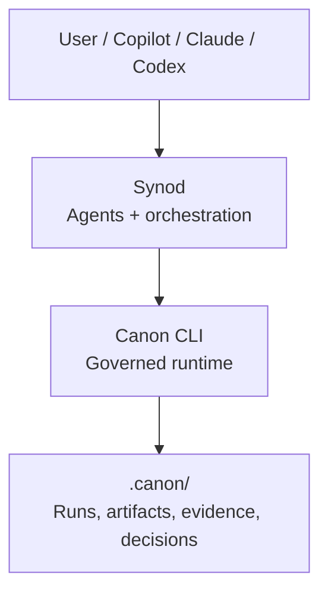

# synod

[](https://github.com/apply-the/synod/actions/workflows/ci.yml)
[](https://github.com/apply-the/synod/actions/workflows/lint.yml)
[](https://github.com/apply-the/synod/actions/workflows/vulnerabilities.yml)
[](https://codecov.io/gh/apply-the/synod)

Synod is a bounded delivery orchestrator. The current repository implements the
core Rust orchestrator plus a local developer CLI for `doctor`, `demo`,
session-backed `start` / `capture` / `plan` / `step` / `run` / `status` /
`next`, and `inspect`, so contributors can exercise the runtime without reading
the test suite first.

Canon remains part of the longer-term architecture discussion below, but the
currently implemented developer experience runs fully locally and does not call
Canon at runtime.

## Separation

- Synod: bounded task orchestration, agent and tool coordination, retries,
  replanning, execution loops, and developer-facing traceability.
- Canon: governed runs, policy and approval gates, artifact contracts, input snapshots, evidence, decision logs, and persistence.

Canon does not orchestrate agents or decide strategy. It enforces how work is recorded and validated.

## Current Build Priorities

For current Synod feature work, the priority order is:

1. execution
2. orchestration
3. decomposition
4. validation
5. optimization
6. polish

Current specs normally defer councils, provider abstraction complexity,
distributed agent systems, long-term memory, UI or UX work, and deployment
pipelines until they are explicitly reprioritized.

## Long-term Architecture



## Long-term Runtime Flow

1. Synod receives a task and selects strategy, agents, and providers.
2. Synod opens a governed run in Canon with risk, zone, and ownership.
3. Agents read inputs and write contract-shaped outputs into Canon artifacts.
4. Canon validates, applies gates, and persists evidence and decisions.
5. Synod continues review, execution, and iteration until completion.

## Design Principle

Canon stays stable as the contract and source of truth. Synod evolves quickly as the intelligence and orchestration layer on top.

## Implemented Core

The current repository implements the delivery orchestrator core as a Rust library crate plus a local CLI binary.

- `synod::Orchestrator`: runs one bounded task through a sequential execution loop.
- `synod::StaticPlanner`: provides deterministic initial plans and queued replans for tests.
- `synod::AgentRegistry` and `synod::ToolRegistry`: register named execution endpoints.
- `synod::FileTraceStore`: persists execution traces under `<workspace>/.synod/traces/`.
- `synod::FileSessionStore` and `synod::SessionRuntime`: persist and resume active session state under `<workspace>/.synod/session.json`.
- `synod::TaskRunRequest` and `synod::TaskRunResponse`: define the run contract used by tests and future delivery flows.
- `synod` CLI binary: exposes `doctor`, `demo`, `start`, `capture`, `plan`, `step`, `run`, `status`, `next`, and `inspect` over the existing core.

The current implementation covers:

- explicit bounded task lifecycle
- persisted workspace-scoped active sessions
- shared task context across steps
- bounded retries and bounded replanning
- deterministic terminal states
- persisted JSON traces for successful and non-successful runs

## Developer CLI

The local `synod` binary keeps the developer experience local, deterministic,
and backed by both `<workspace>/.synod/session.json` and
`<workspace>/.synod/traces/`.

The primary session-native flow is:

1. `synod start`
2. `synod capture --goal "..."`
3. `synod plan`
4. `synod step` or `synod run`
5. `synod status`, `synod next`, and `synod inspect --workspace <workspace>`

For the full command walkthrough and example flows, see
[`specs/004-session-model-unification/quickstart.md`](specs/004-session-model-unification/quickstart.md).

## Assistant Command Packs

The repository also ships assistant-native command packs for Copilot, Codex, and Claude under `assistant/`.
They wrap the existing local CLI instead of introducing a second runtime surface.

- Shared installation and workflow guidance lives in `assistant/README.md`.
- Claude and Codex use slash-style Markdown command files.
- Copilot uses `.prompt.md` prompt files.
- All fallback commands are runnable from the repository root with `cargo run --bin synod -- ...`.

For the assistant workflow walkthrough, see
[`specs/003-assistant-command-packs/quickstart.md`](specs/003-assistant-command-packs/quickstart.md).

## Local Validation

Run these commands from the repository root:

```bash
cargo fmt --all
cargo clippy --all-targets --all-features -- -D warnings
cargo test --all-targets
```
