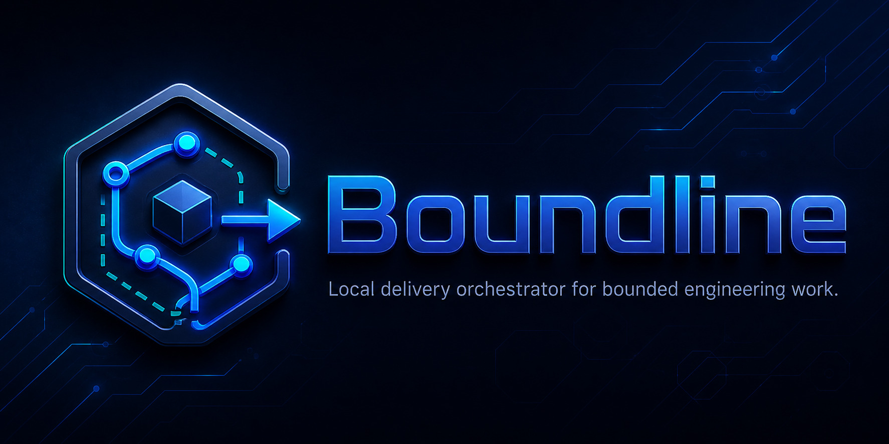

# Boundline


[](https://github.com/apply-the/boundline/releases)
[](LICENSE)
[](https://github.com/apply-the/boundline/actions/workflows/ci.yml)
[](https://github.com/apply-the/boundline/actions/workflows/lint.yml)
[](https://github.com/apply-the/boundline/actions/workflows/vulnerabilities.yml)
[](https://codecov.io/gh/apply-the/boundline)
[](https://sonarcloud.io/summary/new_code?id=apply-the_boundline)
[](https://sonarcloud.io/summary/new_code?id=apply-the_boundline)
[](https://sonarcloud.io/summary/new_code?id=apply-the_boundline)

**Boundline is a local delivery orchestrator for bounded engineering work, from idea intake to verified code changes.**
It applies risk-triggered review councils, authority-zone-aware stop semantics, and explicit admission control at every delivery boundary.
Use it to move through discovery, requirements, architecture, backlog,
implementation, review, and verification as a sequence of bounded sessions
with explicit state, evidence, checkpoints, and governance when needed. It can
pilot larger initiatives as sequences of bounded phases and verifiable units.
Large work is supported by decomposition, not by unbounded autonomy.
Point it at a workspace, give it an idea, brief, or bounded goal, then move
through explicit sessions for planning, execution, inspection, recovery, and
governed delivery when needed. Canon is optional: most users can ignore it
unless they need governed stages or governed artifacts.

The active `0.61.0` feature line is `061-reasoning-profile-contracts`, which
implements the S6 reasoning-profile activation contract between Boundline and
Canon without introducing a second orchestrator. The feature artifacts live
under `specs/061-reasoning-profile-contracts/`; start with the maintainer guide
at `specs/061-reasoning-profile-contracts/quickstart.md`. The shipped runtime
also persists additive reasoning lifecycle and confidence trace events, and it
keeps contract-drift blockers explicit on `run`, `status`, and `inspect` with
the Canon contract line, disagreement summary, and remediation next action.

In `0.58.0`, Boundline also persists advanced-context retrieval state through
goal plans, session status, and trace summaries. The S5 V1 baseline uses one
workspace-local SQLite + FTS5 index plus structured fallback ordering, keeps
retrieved evidence non-authoritative, and exposes selected evidence,
relationships, impact findings, and degraded reasons through `status` and
`inspect`.

The active S5.v2 semantic-acceleration slice stays local and optional. When a
workspace opts into `boundline config set-semantic-acceleration --scope
workspace --policy local`, Boundline refreshes bounded semantic chunks on the
same retrieval index, can expand or rerank the V1 candidate set, and surfaces
`semantic_policy_state`, `semantic_capability_state`, `hybrid_outcome`, match
origin, and rejected semantic candidates through `plan`, `status`, and
`inspect`. When the local semantic capability is unavailable or degraded,
Boundline falls back explicitly to the V1 path instead of hiding the skip.

In `0.56.0`, governed review councils also persist explicit council profile,
independence state, and stop semantics alongside the existing guidance catalog
surfaces, so `status`, `next`, and `inspect` can explain both authority posture
and review posture from the same bounded session state.

## Quick Path Brutale

If Boundline is already installed, this is the shortest path to doing
something useful:

When you already run these commands from inside the target workspace,
Boundline resolves the workspace automatically: it prefers the nearest
initialized `.boundline/` ancestor, then the nearest `.git/` root, and only
then falls back to the current working directory. Use `--workspace <path>` only when
you need to target a different repository explicitly.

On an empty or lightly prepared repository, `boundline run` can still
bootstrap a first bounded change, but only when the goal is specific enough to
name the intended stack, files, or setup shape. If the goal is too vague,
planning stops and asks for clarification instead of guessing.

```bash
cd <workspace>
boundline doctor --install
boundline init --assistant codex
boundline run --goal "Fix the failing add test"
boundline status
boundline inspect
```

If you want to review the plan before execution, use the explicit flow instead:

```bash
cd <workspace>
boundline start
boundline capture --goal "Fix the failing add test"
boundline plan
boundline plan --confirm
boundline run
boundline status
boundline inspect
```

Plain English version of that flow:

- `start` opens the session.
- `capture` records the goal.
- `plan` drafts the work.
- `plan --confirm` approves that draft.
- `run` executes it.
- `status` and `inspect` tell you what happened.

The primary product route stays explicit: `session-native: start a session -> capture a goal -> plan -> confirm -> run -> status -> inspect`.

## Use Boundline from chat

Boundline supports global bootstrap commands and repository-local chat package
surfaces for supported hosts.

Install or reference the global bootstrap package when the host can expose
commands before workspace init:

```bash
boundline assistant install --host codex --scope user
```

The global bootstrap commands are `/boundline:init`, `/boundline:doctor`,
`/boundline:help`, `/boundline:status`, and `/boundline:continue`. Copilot and
Gemini are documented fallback paths rather than claimed universal global
command installs.

In this repository, those package folders are:

- Claude Code: `.claude-plugin/`
- Codex: `.codex-plugin/`
- Cursor: `.cursor-plugin/`
- Copilot-style prompt environments: `.copilot-prompts/` plus
  `assistant/prompts/copilot-command-pack.md`

Minimal example for a Codex-style host:

```bash
cd <workspace>
boundline init --assistant codex
```

That scaffolds the repo-local Boundline files, the shared assistant support
files under `assistant/`, and the selected host package surface such as
`.codex-plugin/`.

When you run `boundline init --assistant claude`, `--assistant codex`, or
`--assistant copilot`, Boundline also writes the matching repo-local package
surface for that host. Exact host registration steps and package locations
outside the repository still depend on the chat host.

For Copilot-style prompt hosts, `boundline init --assistant copilot` scaffolds
`.copilot-prompts/`, `assistant/prompts/copilot-command-pack.md`, and mirrors
the generated prompt files into `.github/prompts/` for VS Code prompt
discovery. `assistant/copilot/prompts/` remains the Boundline-owned source copy,
and you can still reference those generated prompt files explicitly via `#file`
when you want ad hoc prompt use instead of repo-local discovery.

The chat commands are namespaced as `/boundline:*`: start, capture, plan, run,
status, inspect, recover, and conditional govern. They guide the assistant into
Boundline's real CLI/runtime instead of making chat history authoritative.

Think of the chat surface in three layers:

- global bootstrap commands for install, readiness, and scaffolding such as `/boundline:init` and `/boundline:doctor`
- repo-local runtime commands for session state and trace-backed execution such as `/boundline:start`, `/boundline:capture`, `/boundline:plan`, `/boundline:run`, `/boundline:status`, `/boundline:next`, `/boundline:inspect`, and `/boundline:recover`
- guided delivery-intent commands for workflows, governed modes, or named delivery phases when the operator wants a bounded intent surface instead of raw runtime subcommands

Exact host-specific install locations, validation steps, and package
boundaries are in
[docs/guides/assistant-plugin-packages.md](docs/guides/assistant-plugin-packages.md).

Those repo-local assistant surfaces are separate from Boundline's internal
slot routing. You can route planning to Codex, implementation to Copilot,
verification to Gemini, and review to Claude in `.boundline/config.toml`
without needing every host-specific package surface in the repository. The
package folders are only needed when you want that repository to expose
Boundline through those chat hosts directly.

## Use Boundline from CLI

The CLI remains the primary product surface. Use `boundline run --goal "..."`
for the fast path, or the explicit session-native loop when you
want to inspect and confirm the plan:

```bash
boundline start
boundline capture --goal "Fix the failing add test"
boundline plan
boundline plan --confirm
boundline run
boundline status
boundline inspect
```

## How chat commands map to CLI/runtime state

`.boundline/session.json` remains authoritative for session state. Chat hosts
must read the state through Boundline CLI output and preserve `next_command`,
`corrected_command`, trace refs, checkpoint restore commands, and non-success
states such as blocked, clarification-required, failed, exhausted, and terminal.
Host chat history is not authoritative.
Canon governance is conditional and should be surfaced only when the workspace
configuration or user request requires it.

Workspaces are stack-neutral on the native route. Empty, Python, Node, web, and
mixed repositories do not need a `Cargo.toml` just to start. If the captured
goal and repository evidence are too weak to choose a credible stack, planning
stops with an explicit clarification instead of guessing.

`boundline init --assistant claude|copilot|codex|gemini` seeds deterministic
route defaults for the selected assistant and reports the result in the
`route_setup` section, including any fallback provenance and the
`inspect_or_edit` follow-up command. In guided mode, the route prompt now lists
supported slots inline, explains that blank input is allowed when assistant
defaults can seed the missing slots, and shows a valid
`SLOT=RUNTIME:MODEL` example such as `planning=copilot:gpt-5.4`. If a selected
runtime is unavailable for the missing defaults, init either falls back to
another selected available assistant and marks that fallback in `route_setup`,
or stops explicitly when no selected assistant can credibly fill the remaining
slots.
If you do not select any assistant surfaces in guided mode, or do not pass any
`--assistant` flags, `init` still bootstraps `.boundline/` plus any requested
domain or hygiene defaults, but it does not scaffold repository-local assistant
packs. Assistant pack scaffolding is opt-in.
Add `--export-docs` when you want repo-local reference docs under
`docs/boundline/`: Boundline writes a stable Canon reference plus the selected
assistant reference files there. Documentation export is create-only by
default: if target files already exist, Boundline stops and reports the
conflicting paths. Use `--refresh` to update generated docs in place, `--diff`
to preview changes without writing, `--to <path>` to export under another
root, or `--force` for explicit overwrite behavior. Those exported docs are not
session artifacts, so they do not use slugs or timestamps.
When domain families or repository cues are credible, init also applies
merge-only hygiene defaults such as `.gitignore` and `.dockerignore` entries
without removing existing local lines, including legacy ESLint ignores and
bounded Kubernetes-related exclusions when the repository cues justify them.

Most users only need the commands above.

When a mutating `run` or `step` stops in a failed or blocked state, preserve the
reported `latest_checkpoint_*` fields and use `boundline checkpoint list` or the
printed restore command before making unrelated edits.

## Read This In Two Layers

- Quick start: this README plus [docs/getting-started.md](docs/getting-started.md)
- Delivery model: [docs/delivery-model.md](docs/delivery-model.md)
- Authority zones and stop semantics: [docs/authority-zones-and-stop-semantics.md](docs/authority-zones-and-stop-semantics.md)
- Review council algorithms: [docs/review-council-algorithms.md](docs/review-council-algorithms.md)
- Council adoption guide: [docs/council-adoption-guide.md](docs/council-adoption-guide.md)
- Advanced architecture: [docs/architecture.md](docs/architecture.md)
- Extending guidance and guardians: [docs/guides/extending-guidance-catalog.md](docs/guides/extending-guidance-catalog.md)
- Assistant-specific command packs: [assistant/README.md](assistant/README.md)

Stop here if all you need is install, verify, and run. Continue into
`docs/architecture.md` only when you need routing, workflow, cluster,
advanced execution-profile, or governance detail.

## Install

- macOS via Homebrew:

```bash
brew tap apply-the/boundline
brew install boundline
boundline doctor --install
```

The Homebrew tap builds Boundline from the tagged source release and installs
the pinned Canon companion alongside it so the install diagnostics pairing
remains explicit. That path only works after the matching Boundline release tag
and pinned Canon tag have been published upstream. If you are validating an
unreleased branch or the release tags have not landed yet, use the source
fallback below.

- Windows via winget:

```powershell
winget install ApplyThe.Boundline
```

- Source fallback:

```bash
git clone https://github.com/apply-the/boundline.git
cd boundline
cargo install --path .
```

Then verify the install:

```bash
boundline doctor --install
```

That shows the Boundline version, the documented Canon compatibility target,
and whether the local pairing is ready, already satisfied, blocked, or needs
repair.

## Good Fit

Use Boundline when you want to:

- move from an idea or brief into governed delivery work
- shape requirements, architecture, backlog, and implementation slices
- execute bounded code changes with validation, checkpoints, and traceability
- recover, inspect, or continue work across multiple bounded sessions
- coordinate governed stages through Canon when evidence, approval, or published artifacts matter

It is not meant to be a general deployment tool or an open-ended system for
huge refactors.

Advanced execution-profile workflows are documented outside this README.

`.boundline/execution.json` remains available as an explicit compatibility path when you intentionally need the manifest-backed route.

## Command Legend

| Command | Use it for |
| --- | --- |
| `boundline doctor --install` | Verify the installed Boundline plus Canon pairing |
| `boundline doctor` | Check that a workspace is ready |
| `boundline run --goal "..."` | Fastest way to do something useful |
| `boundline start` | Open or reset the active session |
| `boundline capture --goal "..."` | Save the goal or brief into the session |
| `boundline flow bug-fix|change|delivery` | Force the change type instead of inferring it |
| `boundline plan` | Generate the proposed plan |
| `boundline plan --confirm` | Approve that plan so execution can continue |
| `boundline step` | Run one step at a time |
| `boundline checkpoint list|restore` | Inspect or restore the latest local rollback points |
| `boundline status` | See the current state and suggested follow-up |
| `boundline next` | Ask Boundline for the next action |
| `boundline inspect` | Read the latest trace in more detail |
| `boundline init` | Scaffold optional `.boundline` files, opt-in assistant pack defaults, bounded hygiene setup, and optional create-only repo-local reference docs |
| `boundline config` | Inspect or change routing and domain defaults |
| `boundline workflow ...` | Run a named workflow defined by the repo |
| `boundline cluster ...` | Set up or inspect a multi-repo cluster |

## Files Boundline Uses

| File | What it is |
| --- | --- |
| `.boundline/session.json` | Current session state for the default flow |
| `.boundline/checkpoints/` | Local rollback manifests captured before mutating `run` and `step` |
| `.boundline/traces/` | Execution history and inspectable traces |
| `.boundline/config.toml` | Local routing and domain-template settings |
| `docs/boundline/` | Optional repo-local Canon and assistant reference docs exported by `boundline init --export-docs` by default, or another root via `--to` |

## Common Examples

Run directly from a goal:

```bash
boundline run --goal "Fix the failing add test"
```

Bootstrap a first change in a mostly empty repo with an explicit goal:

```bash
boundline run --goal "Create a minimal Vite React TypeScript scaffold with package.json, tsconfig.json, vite.config.ts, index.html, src/main.tsx, and src/App.tsx"
```

If you want repository-local assistant packs as part of setup, choose them
explicitly during guided init or pass them on the command line:

```bash
boundline init --assistant claude --assistant codex --assistant copilot --export-docs
```

Run from a Markdown brief:

```bash
boundline start
boundline capture --brief docs/brief.md
boundline plan
boundline plan --confirm
boundline run
```

Run a named workflow when the repo defines one:

```bash
boundline workflow list
boundline workflow run governed-delivery --goal "Fix the failing add test"
```

Use a cluster when one change spans multiple repos:

```bash
boundline cluster init \
	--workspace <primary-workspace> \
	--cluster-id delivery-a \
	--member <primary-workspace> \
	--member <secondary-workspace>

boundline run --cluster <primary-workspace> --goal "Fix the failing add test"
```

## Boundline And Canon

Boundline is the local delivery orchestrator. Canon is the governed packet runtime.

- Boundline pilots the work: decomposition, session state, planning, execution, inspection, recovery, and validation.
- Canon governs packets, approvals, and governed artifacts when a bounded delivery phase crosses a governance boundary.
- Large work is supported by decomposition, not by unbounded autonomy.

The current release documents Canon `0.57.0` support on the
`canon governance start|refresh|capabilities --json` `v1` adapter surface.

## Community And Support

Use the GitHub templates and policies that match the kind of change or report:

- bug reports, documentation issues, feature requests, and general issues: `.github/ISSUE_TEMPLATE/`
- pull request expectations: `.github/PULL_REQUEST_TEMPLATE.md`
- vulnerability reporting: [SECURITY.md](SECURITY.md)
- participation expectations: `.github/CODE_OF_CONDUCT.md`

## Read More

Keep this README short. Use the other docs only when you need more detail.

- [docs/getting-started.md](docs/getting-started.md) for a longer first-run walkthrough
- [docs/delivery-model.md](docs/delivery-model.md) for the Delivery Pilot Model and project-scale loop
- [docs/architecture.md](docs/architecture.md) for routing, governance, compatibility, and cluster details
- [docs/configuration.md](docs/configuration.md) for `init`, config precedence, and advanced execution-profile setup
- [docs/adaptive-execution.md](docs/adaptive-execution.md) for advanced adaptive manifest-backed execution
- [docs/review-voting.md](docs/review-voting.md) for review councils on the advanced manifest-backed path
- [assistant/README.md](assistant/README.md) for assistant command packs
- [CONTRIBUTING.md](CONTRIBUTING.md) for contributor workflow
- [SECURITY.md](SECURITY.md) for vulnerability reporting
- [ROADMAP.md](ROADMAP.md) for planned releases
- [CHANGELOG.md](CHANGELOG.md) for released changes

## Local Validation

Run these commands from the repository root:

If you install the repository hooks with `./scripts/install-hooks.sh`,
`pre-push` runs the same formatting, lint, test, and coverage checks used by
the blocking GitHub workflows.

```bash
cargo fmt --all -- --check
cargo clippy --workspace --all-targets --all-features -- -D warnings
cargo nextest run --workspace --all-features
cargo llvm-cov --workspace --all-features --lcov --output-path lcov.info
```
