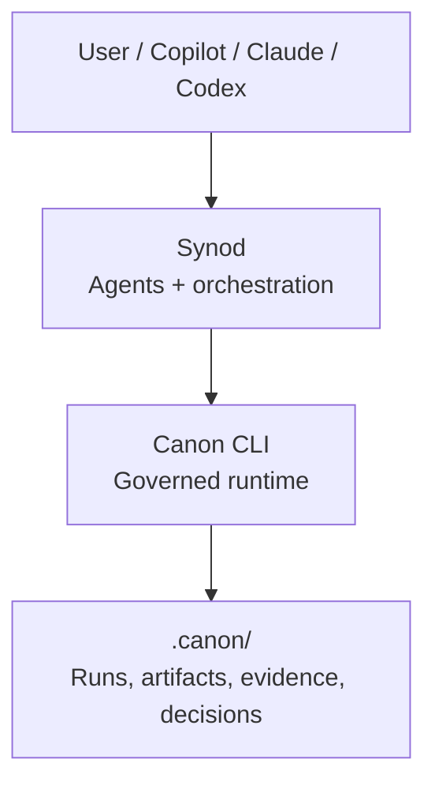

# synod

[](https://github.com/apply-the/synod/actions/workflows/ci.yml)
[](https://github.com/apply-the/synod/actions/workflows/lint.yml)
[](https://github.com/apply-the/synod/actions/workflows/vulnerabilities.yml)
[](https://codecov.io/gh/apply-the/synod)

**Synod is a local CLI for bounded software-delivery work. You run it inside a
workspace to execute manifest-declared changes, validate them, and inspect the
result through session state and traces written back to disk. `synod init`
bootstraps workspace setup, and `synod config` manages routing defaults with
global and workspace precedence.**

## What Synod Does

The main surface is the `synod` CLI:

- `doctor` validates that a workspace is ready to run.
- `init` bootstraps `.synod` workspace files and optional assistant runtime setup.
- `config` shows, sets, and unsets global or workspace routing defaults.
- `start`, `capture`, `flow`, `plan`, and `step` drive the session workflow.
- `run` executes a bounded delivery task end to end.
- `status`, `next`, and `inspect` explain the current session and latest trace.

Use it when you want delivery work to stay bounded and inspectable:

- keep execution rules in `<workspace>/.synod/execution.json`
- apply only manifest-declared changes
- run the workspace validation command after each attempt
- keep session state in `<workspace>/.synod/session.json`
- keep execution traces in `<workspace>/.synod/traces/`

Synod prefers `<workspace>/.synod/execution.json` and falls back to the legacy
`<workspace>/.synod/fixture.json` for older workspaces. Init generates the
modern execution profile by default and creates `.synod/config.toml` for local
routing overrides.

Local execution is the default. When governance is configured, Synod can also
route stages through Canon and project governance state, approvals, packet
provenance, and blocked reasons through the same CLI.

## Canon Compatibility

When Synod governance is configured to use Canon, the current adapter is
validated against Canon `0.20.0`.

That is the Canon CLI version explicitly documented as supported for Synod
`0.9.0`. Earlier or later Canon versions may work, but they are not part of the
documented compatibility surface yet.

For contributor setup and validation expectations, see [CONTRIBUTING.md](CONTRIBUTING.md).

## Install

Requirements:

- Rust `1.95.0`
- `cargo`

Run from source:

```bash
git clone https://github.com/apply-the/synod.git
cd synod
cargo run --bin synod -- --help
```

Install the CLI locally:

```bash
cargo install --path .
synod --help
```

If you are actively changing the repository, prefer `cargo run --bin synod -- ...`
from the repo root so the command always uses your current source tree.

## Use Synod

The shortest way to think about Synod is:

1. Point it at a workspace.
2. Run `synod init` to scaffold bounded defaults.
3. Optionally tune routing defaults with `synod config`.
4. Capture a goal or provide Markdown briefs.
5. Plan and run.
6. Read `status`, `next`, or `inspect` to continue.

### 1. Initialize a workspace

```bash
synod init --workspace <workspace> --template bug-fix
synod doctor --workspace <workspace>
```

Optional routing setup:

```bash
synod config set --scope global --slot planning --runtime codex --model gpt-5-codex
synod config set --workspace <workspace> --scope workspace --reviewer safety --runtime copilot --model gpt-5.4
synod config show --workspace <workspace> --scope effective
```

### 2. Run the session workflow

```bash
synod doctor --workspace <workspace>
synod start --workspace <workspace>
synod capture --workspace <workspace> --goal "Fix the failing add test"
# or capture from one or more Markdown brief files inside the workspace:
synod capture --workspace <workspace> --brief docs/brief.md
synod flow bug-fix --workspace <workspace>
synod plan --workspace <workspace>
synod run --workspace <workspace>
synod status --workspace <workspace>
synod inspect --workspace <workspace>
```

What those commands do, in short:

- `doctor` checks that the workspace and execution manifest are usable.
- `start` initializes the workspace session.
- `capture` stores human-authored goal and brief input in session state.
- `flow` optionally selects `bug-fix`, `change`, or `delivery`.
- `plan` creates the next bounded task from the captured human input plus the workspace manifest.
- `run` executes until Synod reaches a terminal state or needs operator action, still using the workspace manifest as the execution contract.
- `status` reports the current session snapshot.
- `inspect` summarizes the latest trace and evidence.

### 3. Use the direct workflow when you do not need a session

If you do not need the explicit session setup, you can run directly after init:

```bash
synod run --workspace <workspace> --goal "Fix the failing add test"
```

### 4. Inspect what happened

Synod writes:

- session state to `<workspace>/.synod/session.json`
- traces to `<workspace>/.synod/traces/`
- latest execution evidence to the CLI output of `run`, `status`, `next`, and `inspect`

Depending on the manifest, that output can also include:

- changed files and validation status
- adaptive workspace-slice selection and attempt lineage
- review triggers, findings, votes, and outcomes
- governance runtime, mode, approval state, packet provenance, and blocked rationale

## Common Workflow

- run `synod init --workspace <workspace> --template <bug-fix|change|delivery>`
- optionally tune defaults with `synod config show|set|unset`
- run `synod doctor --workspace <workspace>`
- capture a goal with `synod capture` or pass the goal directly to `synod run`
- optionally select `bug-fix`, `change`, or `delivery` with `synod flow`
- run `synod plan` and `synod run`
- inspect the result with `synod status`, `synod next`, and `synod inspect`

## Documentation

Start here if you want more than the short README flow:

- **[Getting Started](docs/getting-started.md)**: install Synod, prepare a workspace, run the first task, then inspect the result
- **[Configuration](docs/configuration.md)**: init templates, routing precedence, and review-role routing
- **[Adaptive Execution](docs/adaptive-execution.md)**: adaptive execution manifest and replanning behavior
- **[Review Voting](docs/review-voting.md)**: review councils and vote resolution
- **[Assistant Command Packs](assistant/README.md)**: assistant command packs for Copilot, Codex, Claude, and Gemini CLI
- **[Changelog](CHANGELOG.md)**: released versions and delivered feature slices

## Separation

- Synod: bounded task orchestration, agent and tool coordination, retries,
  replanning, execution loops, and developer-facing traceability.
- Canon: governed runs, policy and approval gates, artifact contracts, input snapshots, evidence, decision logs, and persistence.

Canon does not orchestrate agents or decide strategy. It enforces how work is recorded and validated.

## Current Build Priorities

For current Synod feature work, the priority order is:

1. execution
2. orchestration
3. decomposition
4. validation
5. optimization
6. polish

Current specs normally defer councils, provider abstraction complexity,
distributed agent systems, long-term memory, UI or UX work, and deployment
pipelines until they are explicitly reprioritized.

## Long-term Architecture



## Long-term Runtime Flow

1. Synod receives a task and selects strategy, agents, and providers.
2. Synod opens a governed run in Canon with risk, zone, and ownership.
3. Agents read inputs and write contract-shaped outputs into Canon artifacts.
4. Canon validates, applies gates, and persists evidence and decisions.
5. Synod continues review, execution, and iteration until completion.

## Design Principle

Canon stays stable as the contract and source of truth. Synod evolves quickly as the intelligence and orchestration layer on top.

## Implemented Core

The current repository implements the delivery orchestrator core as a Rust library crate plus a local CLI binary.

- `synod::Orchestrator`: runs one bounded task through a sequential execution loop.
- `synod::StaticPlanner`: provides deterministic initial plans and queued replans for tests.
- `synod::AgentRegistry` and `synod::ToolRegistry`: register named execution endpoints.
- `synod::FileTraceStore`: persists execution traces under `<workspace>/.synod/traces/`.
- `synod::FileSessionStore` and `synod::SessionRuntime`: persist and resume active session state under `<workspace>/.synod/session.json`.
- `synod::FileConfigStore` and configuration-domain types: persist global and workspace routing defaults with explicit source precedence.
- `synod::ReviewProfile` and related review-domain types: configure bounded councils, reviewer findings, voting, and optional adjudication from `.synod/execution.json`.
- `synod::TaskRunRequest` and `synod::TaskRunResponse`: define the run contract used by tests and future delivery flows.
- `synod` CLI binary: exposes `init`, `config`, `doctor`, `start`, `capture`, `flow`, `plan`, `step`, `run`, `status`, `next`, and `inspect` over the existing core.

The current implementation covers:

- explicit bounded task lifecycle
- persisted workspace-scoped active sessions
- shared task context across steps
- bounded retries and bounded replanning
- deterministic terminal states
- persisted JSON traces for successful and non-successful runs
- bounded review councils with manifest-driven reviewers, vote resolution, and optional adjudication
- bounded adaptive execution with workspace-slice selection, deterministic candidate synthesis, and signature-based replanning
- review evidence projected into `run`, `status`, `next`, and `inspect`

## Developer CLI

The local `synod` binary keeps the developer experience local, deterministic,
and backed by both `<workspace>/.synod/session.json` and
`<workspace>/.synod/traces/`. `doctor`, `plan`, and `run` prefer a workspace
execution manifest at `<workspace>/.synod/execution.json` and fall back to the
legacy `<workspace>/.synod/fixture.json` shape. `synod init` scaffolds the
workspace execution profile and `synod config` manages global and workspace
routing defaults.

The primary init + session flow is:

1. `synod init --workspace <workspace> --template bug-fix|change|delivery`
2. optional: `synod config show|set|unset`
3. `synod start`
4. `synod capture --goal "..."`
5. optional: `synod flow bug-fix|change|delivery`
6. `synod plan`
7. `synod step` or `synod run`
8. `synod status`, `synod next`, and `synod inspect --workspace <workspace>`

When a flow is selected, `status` and `next` surface `active_flow`,
`current_stage`, and `stage_progress`. `run` and `inspect` also render flow and
stage lifecycle events such as flow selection, stage transitions, stage retry,
stage replan, and stage failure. Delivery runs additionally expose
`changed_files`, validation summaries, and trace-visible recovery history.
When a review profile is configured and triggered, `run`, `status`, `next`, and
`inspect` also expose the active review trigger, reviewer findings, vote
summary, and final review outcome. When adaptive execution is active, `run`,
`status`, `next`, and `inspect` also surface the latest `workspace_slice`,
selection headline, validation outcome, and attempt lineage.

For the full command walkthrough and example flows, see
[`specs/004-session-model-unification/quickstart.md`](specs/004-session-model-unification/quickstart.md)
and
[`specs/005-delivery-flows/quickstart.md`](specs/005-delivery-flows/quickstart.md),
and
[`specs/006-execution-engine/quickstart.md`](specs/006-execution-engine/quickstart.md),
and
[`specs/007-multi-agent-review/quickstart.md`](specs/007-multi-agent-review/quickstart.md).

For the adaptive execution manifest shape and bounded replanning behavior in
`0.9.0`, see [`docs/adaptive-execution.md`](docs/adaptive-execution.md).

For the concrete review configuration and voting rules still available in
`0.9.0`, see [`docs/review-voting.md`](docs/review-voting.md).

In `0.9.0`, governed stages can also project `latest_governance_runtime`,
`latest_governance_mode`, `latest_governance_run_ref`, packet provenance,
autopilot candidates, approval waits, and packet rejection outcomes through
`run`, `status`, `next`, and `inspect`.

## Assistant Command Packs

The repository also ships assistant-native command packs for Copilot, Codex, and Claude under `assistant/`.
They wrap the existing local CLI instead of introducing a second runtime surface.

- Shared installation and workflow guidance lives in `assistant/README.md`.
- Claude and Codex use slash-style Markdown command files.
- Copilot uses `.prompt.md` prompt files.
- All fallback commands are runnable from the repository root with `cargo run --bin synod -- ...`.

For the assistant workflow walkthrough, see
[`specs/003-assistant-command-packs/quickstart.md`](specs/003-assistant-command-packs/quickstart.md).

## Local Validation

Run these commands from the repository root:

```bash
cargo fmt --all
cargo clippy --all-targets --all-features -- -D warnings
cargo test --all-targets
cargo llvm-cov --workspace --all-features --lcov --output-path lcov.info
```
