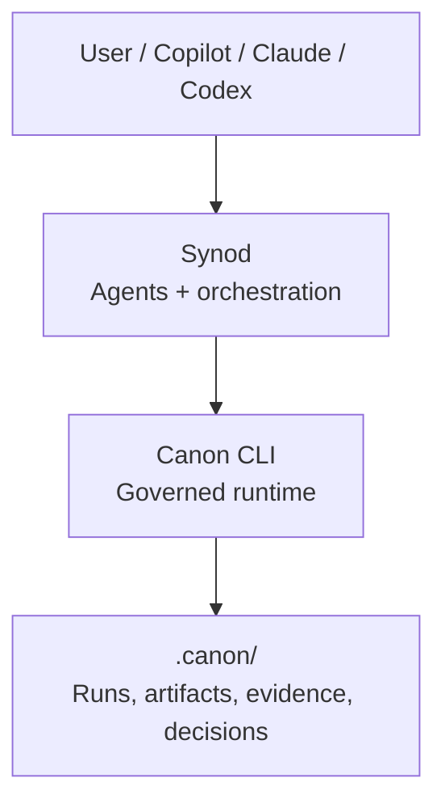

# Synod


[](https://github.com/apply-the/synod/actions/workflows/ci.yml)
[](https://github.com/apply-the/synod/actions/workflows/lint.yml)
[](https://github.com/apply-the/synod/actions/workflows/vulnerabilities.yml)
[](https://codecov.io/gh/apply-the/synod)

**Synod is a local CLI for bounded software-delivery work. The primary path is
session-native: start a session, capture a goal, plan a bounded `GoalPlan`, run
through the decision loop, and inspect the resulting session state and traces.
`synod init` remains optional bootstrap, declarative execution profiles remain
available as an explicit compatibility path, and `synod workflow` adds an
optional thin named-workflow layer over the same session-owned runtime. In
`0.28.0`, `capture` persists one negotiated delivery packet before planning,
`plan` stops early when that negotiation is not yet credible, and `config
show`, `run`, `status`, `next`, and `inspect` project negotiated-delivery
fields plus effective routing, assistant bindings, and persisted route
snapshots across the same session and trace story. `status`, `next`, and
`inspect` now also project `follow_through_guidance`,
`follow_through_evidence_source`, `follow_through_next_action`, and
`follow_through_stop_reason` when persisted session or trace evidence can make
the next bounded action explicit. Native execution now fails
explicitly when the active implementation or verification route requires an
assistant runtime outside declared `assistant_runtimes`. The same
session-native surfaces can also run against `--cluster <primary-workspace>`
so one authoritative session can plan and
deliver a bounded change across registered member repositories while `run`,
`status`, `next`, and `inspect` keep `route_owner`, material
`route_config_projection` including `effective_routing` and
`assistant_bindings`, `cluster_route_owner`,
`cluster_authoritative_workspace`, `cluster_execution_condition`,
participating workspaces, and any blocking member explicit.**

## What Synod Does

The main surface is the `synod` CLI:

- `doctor` validates that a workspace is ready to run.
- `init` optionally bootstraps `.synod` workspace files and assistant runtime setup.
- `config` shows, sets, and unsets routing defaults plus declared assistant runtime capabilities.
- `start`, `capture`, `flow`, `plan`, and `step` drive the session workflow, with `capture` deriving one negotiated delivery packet before planning.
- `run` executes a bounded delivery task end to end, preferring native session planning when a `GoalPlan` exists.
- `status`, `next`, and `inspect` explain the current session, latest compatibility trace, authoritative follow-up state, explicit `route_owner`, material `route_config_projection`, effective routing, assistant bindings, guided follow-through, the active negotiation summary, and cluster authority when a registered cluster owns the run.
- `workflow list|run|status|resume|inspect` lets a named workflow reuse the same route, session, and trace surfaces without introducing a second runtime.

Use it when you want delivery work to stay bounded and inspectable:

- drive work from a captured goal instead of from a pre-authored manifest alone
- make acceptance boundaries and blocking constraints explicit before planning locks the next bounded change
- keep planning, execution, and evidence explicit in session state and traces
- run validation after each bounded action
- resume from saved session state and traces
- fall back to declarative execution profiles only when that compatibility path is intentional

Local execution is the default. When governance is configured, Synod can also
route stages through [Canon](https://github.com/apply-the/canon) while keeping
the same CLI surface.

## Why This Is Better Than Markdown-Only Agent Frameworks

No-code and Markdown-centric agent frameworks are useful when you want to
declare behavior without building much runtime. They are usually good at three
things:

- no-code frameworks: model roles, prompts, routing rules, and handoff shapes
- Markdown-only agents and skills: package reusable instructions, constraints,
	and operator guidance
- workflow files: name repeatable paths and phase order for common tasks

Some orchestration can absolutely be done that way. Markdown agents can route
between roles, skills can constrain behavior, and workflow files can define a
repeatable sequence of phases. That is often enough for lightweight automation
or prompt-driven collaboration.

Where Synod differs is not that orchestration is impossible without it. The
difference is that Markdown and workflow files alone usually make orchestration
convention-based rather than runtime-owned. They describe what should happen,
but they do not by themselves provide an authoritative session model, bounded
planning and replanning, validation execution, resumable state transitions,
trace storage, or governed evidence capture.

Synod uses those artifacts as inputs and interfaces rather than as the source
of orchestration truth:

- Markdown briefs can be captured as human-authored input
- assistant command packs can wrap the CLI for Copilot, Codex, Claude, and
	Gemini while following route-slot binding instead of hard-wired providers
- named workflow definitions can reuse the same bounded session-owned runtime

Synod excels when delivery work must stay inspectable, resumable, and bounded.
It owns the executable control plane: it decides what runs next, records what
happened, mutates the workspace, runs validation, preserves session
continuity, projects the same state through `run`, `status`, `next`, and
`inspect`, and can layer governance on top without changing the operator
surface.

## Canon Compatibility

Canon is the governed runtime Synod can use for policy gates, artifact
contracts, approvals, and evidence capture. Synod still owns orchestration;
Canon owns how governed work is recorded and validated.

Canon is not a mandatory dependency for Synod. You can use Synod on its own
for the default local and session-native workflows; Canon is only needed when
you explicitly enable governed routes.

When Synod governance is configured to use
[Canon](https://github.com/apply-the/canon), the current adapter is validated
against Canon `0.25.0`.

This compatibility note refers to the Canon CLI version only. Earlier or later
Canon versions may work, but they are not part of the documented compatibility
surface yet.

Current Canon support in Synod remains intentionally bounded: Canon governs
stage-level policy, approvals, artifacts, and evidence, while Synod keeps
orchestration ownership and can reuse governed `bug-fix:investigate` plus later
verify-stage `security-assessment` on the same operator surface.

For contributor setup and validation expectations, see [CONTRIBUTING.md](CONTRIBUTING.md).

## Install

Requirements:

- Rust `1.95.0`
- `cargo`

Run from source:

```bash
git clone https://github.com/apply-the/synod.git
cd synod
cargo run --bin synod -- --help
```

Install the CLI locally:

```bash
cargo install --path .
synod --help
```

If you are actively changing the repository, prefer `cargo run --bin synod -- ...`
from the repo root so the command always uses your current source tree.

## Use Synod

The shortest way to think about Synod is:

1. Point it at a workspace.
2. Optionally run `synod init` once if you want scaffolded defaults.
3. Optionally tune routing defaults with `synod config`.
4. Capture a goal or provide Markdown briefs so Synod can persist one negotiated delivery packet.
5. Run `synod plan` to persist a bounded `GoalPlan` only after the negotiated packet is credible, plus any inferred or explicit flow state.
6. Run `synod run` to execute through the native decision loop.
7. Read `status`, `next`, or `inspect` to continue from the active acceptance boundary and follow-up state.

When you want a reusable named entrypoint for the same session-owned route, add
`.synod/workflows.toml` and use:

```bash
synod workflow list --workspace <workspace>
synod workflow run governed-delivery --workspace <workspace> --goal "Fix the failing add test"
synod workflow status --workspace <workspace>
synod workflow resume --workspace <workspace>
synod workflow inspect --workspace <workspace>
```

The workflow layer is intentionally bounded: workflows compile into Synod's
existing `capture`, `clarify`, `plan`, `run`, `review`, `govern`, and `inspect`
phases instead of introducing a generic automation DSL. `workflow list` exposes
named workflow summaries plus invocation guidance, and `workflow run|resume`
can now carry bounded `review` and `govern` phases to completion or an explicit
paused, blocked, or failed state on the same session-owned route.

### 1. Optional bootstrap

```bash
synod init --workspace <workspace>
synod doctor --workspace <workspace>
```

`--template` is optional. If you omit it, Synod starts with `bug-fix`.
Available starting templates are `bug-fix`, `change`, and `delivery`.

A template only seeds the generated compatibility execution profile. It does not lock the
workspace, and it does not decide the later `synod flow` choice.

If you want a different starting point later, rerun init with `--force`:

```bash
synod init --workspace <workspace> --force --template delivery
```

If you just need another task of the same type, do not rerun init. Start a new
session, capture the new goal, and run the workflow again.

Optional routing setup:

```bash
synod config set --scope global --slot planning --runtime codex --model gpt-5-codex
synod config set --workspace <workspace> --scope workspace --reviewer safety --runtime copilot --model gpt-5.4
synod config show --workspace <workspace> --scope effective
```

The effective view now reports the resolved slot route, its authority source,
and the assistant binding implied by that route so backend ownership is clear
before execution starts.

Optional clustered setup across two repositories:

```bash
synod cluster init \
	--workspace <primary-workspace> \
	--cluster-id delivery-a \
	--member <primary-workspace> \
	--member <secondary-workspace>

synod cluster status --workspace <primary-workspace>
synod config set --cluster <primary-workspace> --scope cluster --slot planning --runtime codex --model gpt-5-codex
synod config show --workspace <secondary-workspace> --cluster <primary-workspace> --scope effective
```

Session-native clustered delivery keeps the primary workspace authoritative:

```bash
synod start --cluster <primary-workspace>
synod capture --cluster <primary-workspace> --goal "Fix the failing add test"
synod plan --cluster <primary-workspace>
synod run --cluster <primary-workspace>
synod status --cluster <primary-workspace>
synod inspect --cluster <primary-workspace>
```

### 2. Run the session workflow

```bash
synod doctor --workspace <workspace>
synod start --workspace <workspace>
synod capture --workspace <workspace> --goal "Fix the failing add test"
# or capture from one or more Markdown brief files inside the workspace:
synod capture --workspace <workspace> --brief docs/brief.md
# optional explicit flow selection still exists:
synod flow bug-fix --workspace <workspace>
# or confirm/override during planning:
# synod plan --workspace <workspace> --flow bug-fix
# synod plan --workspace <workspace> --no-flow
synod plan --workspace <workspace>
synod run --workspace <workspace>
synod status --workspace <workspace>
synod inspect --workspace <workspace>
```

When the change spans a registered cluster, enter the same session-native flow
through the primary workspace instead of switching ownership to a member:

```bash
synod start --cluster <primary-workspace>
synod capture --cluster <primary-workspace> --goal "Fix the failing add test"
synod plan --cluster <primary-workspace>
synod run --cluster <primary-workspace>
synod status --cluster <primary-workspace>
synod inspect --cluster <primary-workspace>
```

What those commands do, in short:

- `doctor` checks that the workspace and execution manifest are usable.
- `start` initializes the workspace session.
- `capture` stores human-authored goal and brief input in session state and persists `negotiation_goal_summary`, `negotiation_resolution`, and `negotiation_acceptance_boundary`.
- `flow` optionally selects `bug-fix`, `change`, or `delivery` ahead of planning.
- `plan` derives the next bounded `GoalPlan` from captured input plus workspace state only when the negotiated packet is credible, and persists confirmed, proposed, or absent flow state.
- `run` executes through the native session route whenever a `GoalPlan` exists; governed `bug-fix:investigate` and later verify-stage Canon `security-assessment` can stay on that same route, while declarative `.synod/execution.json` execution remains the explicit compatibility path.
- `status` reports the current session snapshot with explicit `routing`, `execution_condition`, negotiation summary, next-step guidance, and clustered authority or participation cues when the run spans a registered cluster.
- `inspect` summarizes the latest trace and evidence with the same route, negotiation, and execution-condition story plus trace-specific cluster detail.

Optional named workflow layer:

```bash
synod workflow list --workspace <workspace>
synod workflow run governed-delivery --workspace <workspace> --goal "Fix the failing add test"
synod workflow status --workspace <workspace>
synod workflow resume --workspace <workspace>
synod workflow inspect --workspace <workspace>
```

`synod workflow run` reuses the same session-native runtime. It persists named
workflow progress in the active session and reports the same `routing`,
`execution_condition`, and `next_command` story as the direct session commands.
Use `workflow list` first when the workspace offers multiple named workflows or
when an assistant needs discovery guidance instead of reading the raw registry.

### 3. Use the direct compatibility workflow when you do not need a session

If you want the declarative execution-profile path instead of the session-native path, run directly with an explicit workspace and goal:

```bash
synod run --workspace <workspace> --goal "Fix the failing add test"
```

This path uses the workspace execution profile and remains useful for compatibility and test-oriented workflows.

In `0.28.0`, the direct compatibility path also carries the negotiated delivery
summary into `run` and `inspect` so `negotiation_goal_summary`,
`negotiation_resolution`, and `negotiation_acceptance_boundary` stay visible
even when the authoritative follow-up state comes from an explicit
compatibility trace, and the persisted `effective_routing` plus
`assistant_bindings` snapshot remain inspectable after later config changes. The
same inspect path now reuses trace evidence to emit one bounded follow-through
story instead of leaving operators to infer the next action from raw decision
or failure lines alone.

If the execution profile includes an `adaptive` block, failed validation can
re-rank the next bounded candidate from the latest validation evidence without
leaving the manifest-declared `read_targets` set. In `0.28.0`, that bounded
repair path can also choose broader local families such as
`ordering_boundary_flip`, `result_status_flip`, and `numeric_literal_flip`,
surfaces the selected `candidate_family` plus credibility and rejection
reasons, and stops explicitly when the validation evidence is absent or too
weak to justify another materially different bounded attempt.

After an explicit compatibility run, `synod status --workspace <workspace>` and
`synod next --workspace <workspace>` remain usable even when no active session
exists. In that case Synod now reports `continuity_authority:
compatibility_trace`, an inspect-only compatibility follow-up, and
`next_command: synod inspect --workspace <workspace>` so the operator can keep
working from the latest workspace trace without guessing.

### 4. Inspect what happened

Synod writes:

- session state to `<workspace>/.synod/session.json`
- traces to `<workspace>/.synod/traces/`
- latest execution evidence to the CLI output of `run`, `status`, `next`, and `inspect`

Depending on the manifest, that output can also include:

- route explanation, `execution_condition`, and CLI-reported next-command guidance
- `negotiation_goal_summary`, `negotiation_resolution`, and `negotiation_acceptance_boundary` when capture or planning negotiated the bounded delivery story
- `continuity_authority`, compatibility follow-up mode, and inspect-only workspace guidance after explicit compatibility runs that do not leave a resumable session
- `cluster_route_owner`, `cluster_authoritative_workspace`, `cluster_execution_condition`, participating workspaces, and any blocking workspace when a registered cluster owns the run
- changed files and validation status
- adaptive workspace-slice selection, `candidate_family`, selection reason,
  rejected candidates, explicit exhaustion reason, and attempt lineage
- review triggers, findings, votes, and outcomes
- governance runtime, mode, approval state, packet provenance, and blocked rationale

## Common Workflow

- run `synod init --workspace <workspace>`
- optionally add `--template change` or `--template delivery` when you want a different starting profile than the default `bug-fix`
- optionally tune defaults with `synod config show|set|unset`
- run `synod doctor --workspace <workspace>`
- capture a goal with `synod capture`
- optionally select `bug-fix`, `change`, or `delivery` with `synod flow`, or confirm it during `synod plan`
- run `synod plan` and `synod run` for the native session path
- use direct `synod run --workspace <workspace> --goal ...` only when you intentionally want execution-profile compatibility behavior
- inspect the result with `synod status`, `synod next`, and `synod inspect`

## Documentation

Start here if you want more than the short README flow:

- **[Getting Started](docs/getting-started.md)**: install Synod, prepare a workspace, run the first task, then inspect the result
- **[Configuration](docs/configuration.md)**: init templates, routing precedence, and review-role routing
- **[Adaptive Execution](docs/adaptive-execution.md)**: adaptive execution manifest and replanning behavior
- **[Review Voting](docs/review-voting.md)**: review councils and vote resolution
- **[Assistant Command Packs](assistant/README.md)**: assistant command packs for Copilot, Codex, Claude, and Gemini CLI
- **[Changelog](CHANGELOG.md)**: released versions and delivered feature slices

## Separation

- Synod: bounded task orchestration, agent and tool coordination, retries,
  replanning, execution loops, and developer-facing traceability.
- Canon: governed runs, policy and approval gates, artifact contracts, input snapshots, evidence, decision logs, and persistence.

Canon does not orchestrate agents or decide strategy. It enforces how work is recorded and validated.

## Current Build Priorities

For current Synod feature work, the priority order is:

1. execution
2. orchestration
3. decomposition
4. validation
5. optimization
6. polish

Current specs normally defer councils, provider abstraction complexity,
distributed agent systems, long-term memory, UI or UX work, and deployment
pipelines until they are explicitly reprioritized.

## Long-term Architecture



## Long-term Runtime Flow

1. Synod receives a task and selects strategy, agents, and providers.
2. Synod opens a governed run in Canon with risk, zone, and ownership.
3. Agents read inputs and write contract-shaped outputs into Canon artifacts.
4. Canon validates, applies gates, and persists evidence and decisions.
5. Synod continues review, execution, and iteration until completion.

## Design Principle

Canon stays stable as the contract and source of truth. Synod evolves quickly as the intelligence and orchestration layer on top.

## Implemented Core

The current repository implements the delivery orchestrator core as a Rust library crate plus a local CLI binary.

- `synod::Orchestrator`: runs one bounded task through a sequential execution loop.
- `synod::StaticPlanner`: provides deterministic initial plans and queued replans for tests.
- `synod::AgentRegistry` and `synod::ToolRegistry`: register named execution endpoints.
- `synod::FileTraceStore`: persists execution traces under `<workspace>/.synod/traces/`.
- `synod::FileSessionStore` and `synod::SessionRuntime`: persist and resume active session state under `<workspace>/.synod/session.json`, with clustered delivery keeping the authoritative session in the primary workspace while member workspaces persist their own terminal traces.
- `synod::FileConfigStore` and configuration-domain types: persist global and workspace routing defaults with explicit source precedence.
- `synod::ReviewProfile` and related review-domain types: configure bounded councils, reviewer findings, voting, and optional adjudication from `.synod/execution.json`.
- `synod::TaskRunRequest` and `synod::TaskRunResponse`: define the run contract used by tests and future delivery flows.
- `synod` CLI binary: exposes `init`, `config`, `doctor`, `start`, `capture`, `flow`, `plan`, `step`, `run`, `status`, `next`, and `inspect` over the existing core.

The current implementation covers:

- explicit bounded task lifecycle
- persisted workspace-scoped active sessions, including primary-owned clustered sessions with member-local traces
- shared task context across steps
- bounded retries and bounded replanning
- deterministic terminal states
- persisted JSON traces for successful and non-successful runs
- bounded review councils with manifest-driven reviewers, vote resolution, and optional adjudication
- bounded adaptive execution with workspace-slice selection, validation-guided slice reselection, deterministic local candidate synthesis, and signature-based replanning
- review evidence projected into `run`, `status`, `next`, and `inspect`
- clustered delivery authority, participation, blocking, and inspectable member-trace handoff under one primary session owner

## Developer CLI

The local `synod` binary keeps the developer experience local, deterministic,
and backed by both `<workspace>/.synod/session.json` and
`<workspace>/.synod/traces/`. `synod init` scaffolds the workspace execution
profile at `<workspace>/.synod/execution.json` only for the explicit compatibility path, and `synod config` manages
global and workspace routing defaults.

The primary init + session flow is:

1. `synod init --workspace <workspace>`
2. optional: if you want a non-default starting profile, rerun or start with `--template change|delivery`
3. optional: `synod config show|set|unset`
4. `synod start`
5. `synod capture --goal "..."`
6. optional: `synod flow bug-fix|change|delivery`
7. `synod plan`
8. `synod step` or `synod run`
9. `synod status`, `synod next`, and `synod inspect --workspace <workspace>`

When a flow is selected, `status` and `next` surface `active_flow`,
`current_stage`, and `stage_progress`. `run` and `inspect` also render flow and
stage lifecycle events such as flow selection, stage transitions, stage retry,
stage replan, and stage failure. Delivery runs additionally expose
`changed_files`, validation summaries, and trace-visible recovery history.
When a review profile is configured and triggered, `run`, `status`, `next`, and
`inspect` also expose the active review trigger, reviewer findings, vote
summary, and final review outcome. When adaptive execution is active, `run`,
`status`, `next`, and `inspect` also surface the latest `workspace_slice`,
selection headline, `candidate_family`, selection reason, rejected candidates,
validation outcome, explicit exhaustion reason when bounded recovery stops, and
attempt lineage, including validation-guided slice changes on the explicit
compatibility path.

For the full command walkthrough and example flows, see
[`specs/004-session-model-unification/quickstart.md`](specs/004-session-model-unification/quickstart.md)
and
[`specs/005-delivery-flows/quickstart.md`](specs/005-delivery-flows/quickstart.md),
and
[`specs/006-execution-engine/quickstart.md`](specs/006-execution-engine/quickstart.md),
and
[`specs/007-multi-agent-review/quickstart.md`](specs/007-multi-agent-review/quickstart.md).

For the adaptive execution manifest shape and bounded compatibility behavior in
the current release, see [`docs/adaptive-execution.md`](docs/adaptive-execution.md).

For the concrete review configuration and voting rules still available in
`0.17.0`, see [`docs/review-voting.md`](docs/review-voting.md).

In `0.28.0`, governed stages can also project `latest_governance_runtime`,
`latest_governance_mode`, `latest_governance_run_ref`, packet provenance,
autopilot candidates, approval waits, packet rejection outcomes, and bounded
`bug-fix:investigate` to `verify` lineage through `run`, `status`, `next`,
`inspect`, and the workflow-aware surfaces. Explicit compatibility follow-up
can now also surface `continuity_authority`, `compatibility_follow_up`,
broader adaptive candidate credibility, negotiation summary, `follow_through_*`
guidance, and inspect-only guidance through those same read-side commands
without implying that the route
silently became session-native. Clustered session-native delivery also keeps
the primary workspace authoritative while surfacing `cluster_route_owner`,
`cluster_authoritative_workspace`, `cluster_execution_condition`, and any
blocking member explicitly on the same read-side surfaces.

## Assistant Command Packs

The repository also ships assistant-native command packs for Copilot, Codex, and Claude under `assistant/`.
They wrap the existing local CLI instead of introducing a second runtime surface.

- Shared installation and workflow guidance lives in `assistant/README.md`.
- Claude and Codex use slash-style Markdown command files.
- Copilot uses `.prompt.md` prompt files.
- All fallback commands are runnable from the repository root with `cargo run --bin synod -- ...`.

For the assistant workflow walkthrough, see
[`specs/003-assistant-command-packs/quickstart.md`](specs/003-assistant-command-packs/quickstart.md).

## Local Validation

Run these commands from the repository root:

If you install the repository hooks with `./scripts/install-hooks.sh`,
`pre-push` runs the same formatting, lint, test, and coverage checks used by
the blocking GitHub workflows.

```bash
cargo fmt --all -- --check
cargo clippy --workspace --all-targets --all-features -- -D warnings
cargo nextest run --workspace --all-features
cargo llvm-cov --workspace --all-features --lcov --output-path lcov.info
```
