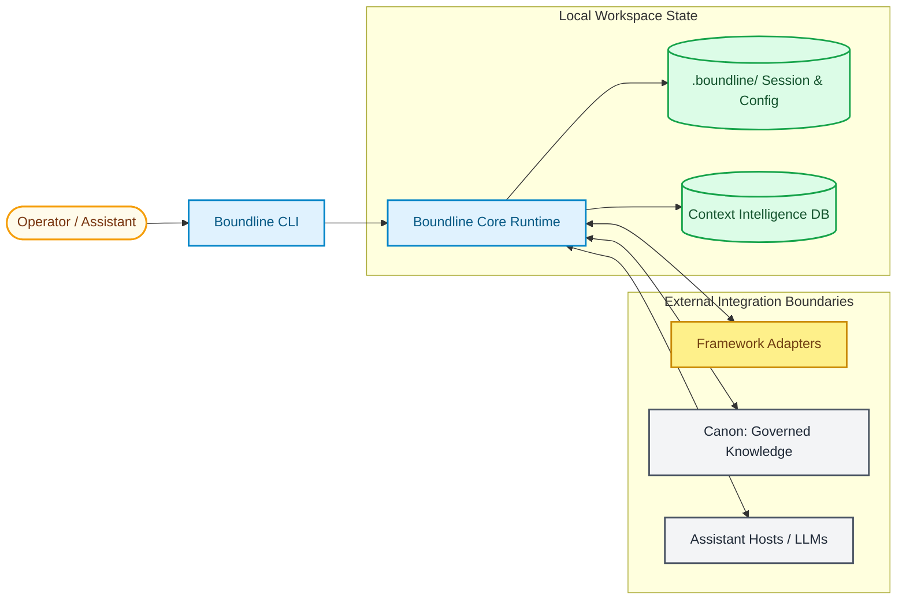
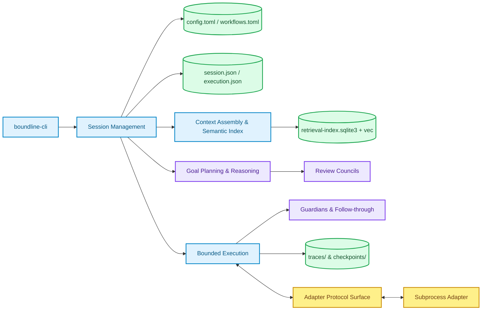

# Architecture

Boundline is a bounded delivery runtime for AI-assisted engineering work. It
keeps software delivery in inspectable, governed, and recoverable runtime state
instead of treating chat history as the source of truth.

## High-Level Architecture



## Component Drill-Down



## Primary Runtime Model

The normal operator path is goal-first:

```text
init → goal → plan → run → status → next → inspect
```

Two optional preflight surfaces can sit in front of that loop:

- `boundline models auth ...` for user-scoped provider credentials
- `boundline probe` for a read-only readiness answer

Read-side commands project persisted runtime state from `.boundline/` instead
of inventing a new story from logs or chat memory.

## Repo-Visible Document Boundary

Boundline keeps runtime state separate from repo-visible delivery knowledge:

- `.boundline/` owns session state, traces, checkpoints, and transient
    governance artifacts.
- `.boundline/context-intelligence/` owns the derived retrieval DB,
    `manifest.json`, and SQLite WAL/SHM sidecars used by local semantic
    retrieval.
- `.canon/` owns raw Canon packets and Canon runtime payloads.
- `docs/project/` owns stable reusable project memory.
- `docs/evidence/` owns durable feature outputs and evidence bundles.

See [Project Memory Structure](../reference/file-layout).

## Core Runtime Decisions

- Session runtime is the authoritative control plane for lifecycle transitions,
    goal state, next-action projection, and recovery posture.
- Planning is evidence-driven: goals, briefs, workspace evidence, recent
    traces, and compatible Canon artifacts shape one bounded context pack.
- Execution stays bounded: reads, edits, validation, and follow-through happen
    as explicit actions, with checkpoints available before mutation.
- Guidance, guardians, traces, and checkpoints make the path inspectable rather
    than conversationally implied.
- Canon remains an external governed-knowledge boundary, not Boundline's
    orchestrator.

The current Boundline `0.76.0` line documents Canon `0.71.0` support for
`canon governance start|refresh|capabilities --json` `v1`.

The runtime owns the derived semantic index lifecycle under
`.boundline/context-intelligence/`, including the retrieval DB,
`manifest.json`, explicit `boundline index ...` commands, and lightweight
stale-mark hook behavior when the operator opts in.

Delivery gates are additive and cumulative across the runtime:

- **Plan-quality gate** (`0.67.0`): blocks execution until plan readiness is
  confirmed; one-question recovery when evidence is missing.
- **Backlog-quality gate** (`0.69.0`): blocks closure-limited Canon backlog
  packets, surfaces additive backlog-quality fields, and requests clarification
  when execution-handoff evidence is absent.
- **Planning-analysis gate** (`0.70.0`): validates cross-artifact coherence
  (goal outcomes, validation coverage, slice sequencing, execution-handoff
  inputs, governed producer evidence) and withholds execution on contradictions
  or producer gaps.
- **Context substrate** (`0.71.0`): projects typed context-pack entries,
  omission findings, repository-map readiness, digest-backed compaction,
  snapshot-cache freshness, and patch-safe edit attempt state. Stays local,
  deterministic, and derived; does not replace reviewed memory.
- **Capability-provider protocol** (`0.72.0`): explicit registration,
  activation, health checks, permission admission, bounded
  prepare/execute/evidence collection, and accepted-versus-rejected evidence
  projection. Provider output remains subordinate to Boundline validation.
- **Evals & runtime observability** (`0.73.0`): local quality evals, trace
  compaction with five retention classes, structured event vocabulary, JSONL
  export, and CI-compatible eval summaries.
- **Review councils & role-gated governance** (`0.74.0`): guardian activation
  router, council adjudication, and role-gated governance with trace-visible
  override and escalation records.
- **Adaptive governance calibration** (`0.75.0`): graduated control levels
  (advisory → catch → rule → hook), calibration policy, `boundline override`
  for operator bypass, and trust-evolution tracking.
- **Stage-refinement profiles** (`0.76.0`): bounded, inspectable refinement
  loops with `planner → critic → planner → finalizer` pattern, structured
  round packets, hard round limits, no-progress detection, time budgets, and 9
  closed stop reasons. CLI flags `--refine`, `--no-refine`, `--max-rounds N`.

## Framework Adapter Boundary

Framework adapters extend the runtime without replacing it.

- Boundline remains the orchestrator and the default execution path.
- One workspace may select one adapter or none.
- The host owns capability validation, config persistence, routing decisions,
  and operator-visible status or inspect output.
- Adapters only own the stages they explicitly declare and successfully claim.

The V1 wire contract stays bounded to one-shot trusted local subprocess
commands, UTF-8 JSON over stdin/stdout, one standard success or error envelope
on stdout, optional structured stderr copied into traces only as enrichment,
and no graceful shutdown or persistent transport lifecycle.

Current public repositories on this line:

- [boundline-framework-template](https://github.com/apply-the/boundline-framework-template): reference template for building a compatible framework adapter.
- [boundline-adapter-speckit](https://github.com/apply-the/boundline-adapter-speckit): concrete Speckit adapter implementation used to exercise the claimed `plan` and `run` handoff path.

## Runtime Families

Boundline currently ships three runtime-owned algorithm families:

- **Review councils**: council assembly, independence guarding, vote
  resolution, and bounded adjudication projection.
- **Reasoning profiles**: profile activation, independence assessment, bounded
  profile outcomes, and confidence handoff. Surfaced profiles include
  `bounded_self_consistency`, `independent_pair_review`,
  `heterogeneous_security_review`, and `bounded_reflexion`.
- **Stage refinement**: bounded iterative refinement over a specific planning
  stage with structured round packets, critic-proposed confidence scoring,
  material-delta detection, finding deduplication, and a closed set of 9 stop
  reasons. The currently surfaced refinement profile is `plan_refinement`.

## Operator Commands

| Command | Purpose |
|---|---|
| `boundline init` | Bootstrap a fresh workspace. |
| `boundline goal` | Inject an operator requirement. |
| `boundline plan [--refine\|--no-refine] [--max-rounds N]` | Generate a bounded plan, optionally with stage refinement. |
| `boundline run` | Execute the plan sequentially. |
| `boundline status` | Read current session state. |
| `boundline next` | Project the next recommended action, including refinement suggestions. |
| `boundline inspect` | Drill into session, trace, or refinement round details. |
| `boundline override` | Operator bypass of catch and rule findings. |
| `boundline probe` | Read-only readiness check (init vs doctor vs session-ready). |
| `boundline models auth login\|status\|remove` | Manage provider credentials. |
| `boundline help-next` | Contextual operator guidance surface. |

## Runtime Data Flow

1. Observe: assemble bounded context from workspace evidence, authored input,
     traces, and compatible Canon artifacts.
2. Decide: resolve the next bounded action and any required governance,
     council, or reasoning behavior.
3. Act: execute the action and persist session plus trace updates.
4. Verify: use validation, guardians, and any required follow-through to decide
     whether the session may continue, degrade, or stop.
