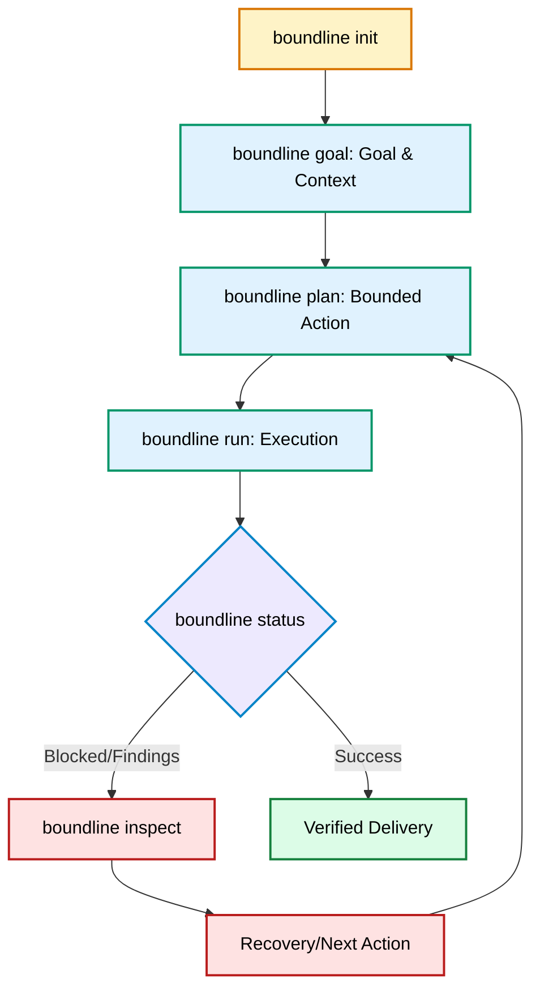

# Core Concepts

Boundline is easiest to understand as a runtime that keeps AI-assisted delivery bounded, inspectable, and recoverable.

## Session Lifecycle



## Bounded Sessions

A bounded session is the active container for one delivery goal. It records the goal, context, plan, execution state, findings, traces, checkpoints, and next action.

Start one explicitly:

```bash
boundline init --workspace .
boundline goal --workspace . --goal "Add validation for imported customer emails"
boundline plan --workspace .
```

The session prevents broad, uncontrolled work by making the current boundary visible.

## Runtime State

Runtime state lives in the workspace, normally under `.boundline/`.

Important surfaces:

- `.boundline/session.json`: active session state
- `.boundline/config.toml`: workspace configuration
- `.boundline/traces/`: persisted decision and execution traces
- `.boundline/checkpoints/`: rollback manifests for mutating runs

Assistant chat history is not runtime state.

## Context Packs

A context pack is the bounded evidence set Boundline uses to plan or continue. It can include:

- the captured goal
- authored briefs
- relevant files
- failing validation output
- recent changed files
- previous traces
- guidance sources
- Canon project memory or governed artifacts when configured

If context is insufficient, Boundline should stop and ask for clarification or better evidence.

## Expert Packs

Expert packs provide reusable expertise for languages, frameworks, domains, review profiles, and delivery roles. Boundline can select packs from built-in sources, bundled assistant packs, workspace overrides, or compatible governed inputs.

See [Shared Expert Packs](/governance/guardians#shared-expert-packs).

## Guidance

Guidance shapes work before and during action. It can describe architecture expectations, testing discipline, language practices, security rules, migration policy, or domain conventions.

Guidance answers: "What should the worker know before acting?"

See [Guidance And Guardians](/governance/guardians).

## Guardians

Guardians check work after action or at quality boundaries. They can be deterministic, LLM-based, or hybrid. They emit structured findings such as observations, warnings, risks, blockers, or errors.

Guardians answer: "What should be checked before continuing?"

## Structured Findings

Findings are not vague comments. They should preserve severity, source, scope, evidence, and blocking outcome when available. Use `status` and `inspect` to read them:

```bash
boundline status --workspace . --json
boundline inspect --workspace . --json
```

## Delivery Councils & Authority Zones

Boundline can assemble a **Delivery Council** at critical delivery boundaries (e.g., planning, implementation, verification) based on the risk and authority zone of the work.
- **Authority Zones:** Control classes mapped from Canon's `authority-governance-v1` metadata (`green`, `yellow`, `red`, `restricted`).
- **Council Profiles:** Depending on the authority zone, Boundline activates specific council profiles (e.g., `yellow_pair`, `red_five`) that dictate the number and type of independent reviewers required before the session can proceed.

## Adjudication & Producer Responses

When a Council Guardian emits a **concern** or **blocking finding**, it is not just informational. The producer must explicitly respond (`accepted`, `rejected`, `deferred`) with rationale.
- Accepting a blocking finding automatically generates remediation work or follow-up tasks within the session.
- Unresolved blocking findings result in a `hard_stop` or `adjudication_required` state, preventing the work from bypassing governance.

## Reasoning Profiles

Reasoning profiles are bounded runtime challenge patterns that activate when governance posture, stage policy, or operator policy requires stronger challenge than a single linear execution step.

In `0.63.0`, the same runtime now carries that reasoning story through the
assistant-facing follow-through surfaces: `status`, `inspect`, `why`, `risk`,
`evidence`, `next-best`, `challenge`, and `explain-plan` can all disclose the
active profile, selection reason, contribution, and fallback wording.

The current shipped reasoning-profile surface is intentionally small:

- `bounded_self_consistency`
- `independent_pair_review`
- `heterogeneous_security_review`
- `bounded_reflexion`
- debate as bounded substrate rather than a standalone shipped profile
- adjudication as a shared primitive rather than a standalone shipped profile

## Control Graduation & Adaptive Governance

Starting from version **0.63.0**, Boundline keeps governance explicit through rollout profiles and runtime states rather than introducing a second orchestration system or a hidden learning layer.
- **Rollout Profiles:** Workspaces progress through maturity levels: `minimal`, `guided`, `governed`, and `strict`.
- **Runtime States:** Governance operates in distinct states (`advisory`, `catch`, `rule`, `hook`). New or uncalibrated surfaces start in `advisory` mode.
- **Canon Inputs:** Canon can supply required `authority-governance-v1` metadata and optional additive `adaptive-governance-v1` metadata, but Boundline still resolves the effective runtime posture locally.
- **Degradation & Escalation:** If evidence is weak, trust is low, or reviewers are unavailable, Boundline safely degrades (e.g., smaller council, advisory fallback) or escalates explicitly, maintaining traceability rather than silently weakening governance.

## Traces

Traces explain what happened and why. They preserve decisions, selected context, route choices, executed commands, skipped checks, findings, blocking states, and next actions.

The `0.63.0` line also projects human-facing inspect closures from the same
trace authority: `inspect_context`, `inspect_council`, and `inspect_timeline`.

## Delight Feedback Signals

Delight feedback signals are lightweight session-scoped usefulness measures.
They are not a second telemetry runtime. Current examples include time to first
useful answer, explanation attribution rate, next-action acceptance rate, and
the latest next-action outcome.

See [Traces And Inspectability](/runtime/trace).

## Recovery

Recovery starts from runtime state, not guesswork:

```bash
boundline status --workspace .
boundline next --workspace .
boundline inspect --workspace .
```

When a checkpoint exists, prefer the reported restore command over a generic reset.
