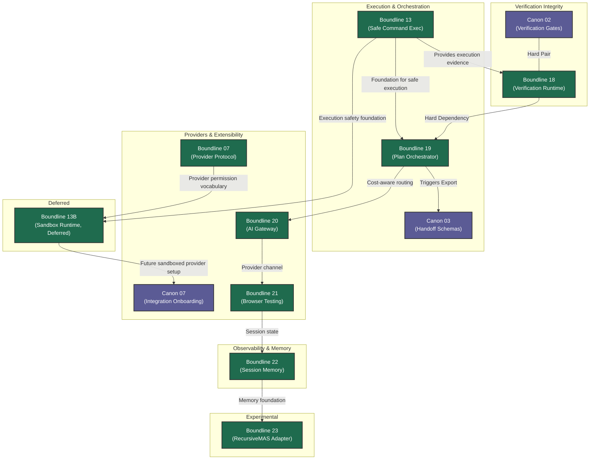

# Canon & Boundline Joint Feature Rollout

This document illustrates the operational sequence for the joint development of Canon and Boundline features. It encompasses all features from both roadmaps, grouping them by domain and showing critical execution dependencies.

## Dependency Graph

## Execution Order and Dependencies

1. **Canon 02 + Boundline 18 (Verification Pair)**
   - Delivered in 0.80.0. Canon defines the `claim -> proof -> evidence_ref` contract, while Boundline implements the runtime that executes the proof and blocks task completion.
2. **Boundline 13 (Execution Safety Foundation)**
   - Boundline 13 establishes safe local command execution, evidence capture,
     artifact capture, redaction, and mutation boundaries. It supports
     verification and orchestration without requiring Docker sandboxing.
   - B13 is pulled earlier because safe command execution, evidence capture,
     artifact capture, and redaction are needed before orchestration becomes
     trustworthy.
3. **Boundline 19 (Execution Orchestrator)**
   - Depends directly on `Boundline 18` to ensure that task ordering, checkpointing, and resume logic rely on a solid verification gate.
   - Benefits from `B13` execution evidence and safety foundation.
4. **Boundline 20 (AI Gateway & Inference Economics)**
   - Depends on `B19` for cost-aware routing decisions during task execution.
   - Depends on `B07` (provider protocol) and `B08` (evals) for route health and telemetry.
   - Adds route latency/cost telemetry, session cost budgets, tiered model routing, and fallback policy.
5. **Boundline 21 (Browser Testing Provider)**
   - Depends on `B20` for the provider channel and route economics.
   - Implements browser validation as a concrete provider over the protocol, not as core runtime.
6. **Boundline 22 (Session Memory)**
   - Depends on `B21` for session state visibility.
   - Starts with confirmation-first trace distillation; no autonomous memory.
7. **Boundline 23 (RecursiveMAS Provider — Experimental)**
   - Depends on `B22` for memory foundations.
   - Evaluates real latent-space recursion as an external read-only provider after provider, eval, route-budget, and host-refinement boundaries exist.
8. **Canon 03 (Parallel to 19)**
   - Defines purely the handoff/progress schema. It can be developed in parallel to the Boundline execution engine, or right before its integration to allow Boundline to export compatible packets.
9. **Boundline 07 (Provider Protocol)**
   - The external provider setup (MCP, setup, activation, health). Establishes the plugin layer that powers B14, B15, and B17.
10. **Deferred: Boundline 13B (Sandbox Runtime)**
   - Boundline 13B adds local sandbox execution for high-risk provider-backed
     or mutation-heavy commands. It depends on the provider permission
     vocabulary from B07 and the execution evidence foundation from B13A.
   - B13B is deferred because Docker sandboxing, mount policy, network
     policy, and secret handle inheritance depend on provider permissions
     and execution policy foundations. It should not block the core
     verification and orchestration loop.
11. **Canon 07 (After provider setup)**
   - Arrives at the end to close the loop on the CLI side (Canon init) by gathering local routing choices, delegating execution back to Boundline.
