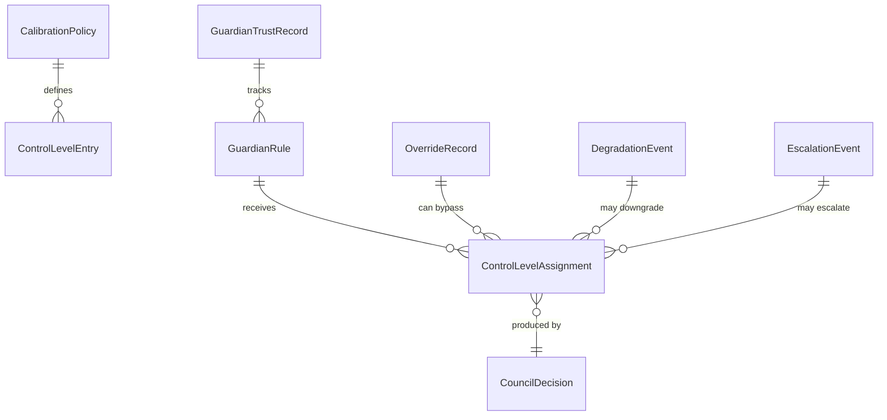

# Data Model: Adaptive Governance Calibration

**Feature**: 075-adaptive-governance-calibration
**Date**: 2026-06-06

## Entity Overview



## Entities

### CalibrationPolicy

Stored in `.boundline/calibration-policy.toml`. Versioned. Maps guardian rules to control levels.

| Field | Type | Description |
|-------|------|-------------|
| `schema_version` | `String` | Policy schema version (e.g., `"1.0"`) |
| `evidence_window` | `u32` | Minimum adjudicated sessions before trust rates affect levels (default 5) |
| `minimum_evidence_threshold` | `u32` | Minimum adjudicated sample size before TPR/FPR computed (default 3) |
| `entries` | `Vec<ControlLevelEntry>` | Per-guardian-rule calibration entries |

### ControlLevelEntry

A single calibration row in the policy.

| Field | Type | Description |
|-------|------|-------------|
| `rule_id` | `String` | References a guardian rule id in `guardian-rules.toml` |
| `authority_zone` | `AuthorityZone` | `green`, `yellow`, or `red` |
| `risk_level` | `RiskLevel` | `low`, `medium`, `high` |
| `default_level` | `ControlLevel` | Level when no trust data exists |
| `green_level` | `ControlLevel` | Level when in green zone with sufficient trust |
| `yellow_level` | `ControlLevel` | Level when in yellow zone |
| `red_level` | `ControlLevel` | Level when in red zone |
| `confidence_threshold` | `f64` | Minimum calibrated confidence (0.0–1.0) for promotion eligibility |
| `override_policy` | `OverridePolicy` | Who can override, required evidence, time-limit |

### ControlLevel (enum)

| Variant | Meaning | Blocks? |
|---------|---------|---------|
| `Advisory` | Finding visible, does not block | No |
| `Catch` | Finding needs attention, human can bypass | No (with override) |
| `Rule` | Blocks unless override policy satisfied | Yes (unless overridden) |
| `Hook` | Unconditional block, privileged bypass only | Yes |

### AuthorityZone (enum)

| Variant | Description |
|---------|-------------|
| `Green` | Low-risk, routine work |
| `Yellow` | Medium-risk, needs attention |
| `Red` | High-risk, strict enforcement |

### OverridePolicy

| Field | Type | Description |
|-------|------|-------------|
| `allowed_roles` | `Vec<String>` | Who can override (e.g., `["operator", "maintainer"]`) |
| `required_evidence` | `Vec<String>` | What evidence must accompany the override |
| `time_limited` | `bool` | Whether the override expires |
| `max_duration_hours` | `Option<u32>` | Expiry in hours if time-limited |

### ControlLevelAssignment

The current level assignment for a guardian in a workspace context.

| Field | Type | Description |
|-------|------|-------------|
| `rule_id` | `String` | Guardian rule id |
| `assigned_level` | `ControlLevel` | Current control level |
| `guardian_confidence` | `f64` | Raw confidence from guardian (0.0–1.0) |
| `calibrated_confidence` | `f64` | Confidence after trust adjustment (0.0–1.0) |
| `authority_zone` | `AuthorityZone` | Zone at assignment time |
| `risk_level` | `RiskLevel` | Risk at assignment time |
| `reason` | `String` | Human-readable reason for the level assignment |
| `degraded_from` | `Option<ControlLevel>` | Original level if degraded |
| `degradation_reason` | `Option<String>` | Why degradation occurred |

### GuardianTrustRecord

Accumulated trust metrics for a guardian. Persisted in trace store.

| Field | Type | Description |
|-------|------|-------------|
| `rule_id` | `String` | Guardian rule id |
| `true_positive_count` | `u64` | Findings upheld as valid |
| `false_positive_count` | `u64` | Findings rejected as invalid/incorrect |
| `deferred_count` | `u64` | Findings pending resolution |
| `accepted_override_count` | `u64` | Overrides accepted by council |
| `repeated_violation_count` | `u64` | Same finding reappearing across sessions |
| `incident_correlation` | `bool` | Correlated with a past incident |
| `eval_pass_rate` | `Option<f64>` | Latest eval pass rate (0.0–1.0) |
| `last_evaluated_at` | `String` | ISO 8601 timestamp of last trust evaluation |

**Computed**: `true_positive_rate = true_positive_count / (true_positive_count + false_positive_count)` — only computed when `true_positive_count + false_positive_count >= minimum_evidence_threshold`.

### OverrideRecord

Written by `boundline override`, stored in `.boundline/overrides.toml`.

| Field | Type | Description |
|-------|------|-------------|
| `finding_id` | `String` | Identifier of the blocked finding |
| `control_id` | `String` | Identifier of the control being overridden |
| `guardian_id` | `String` | Guardian that produced the finding |
| `requested_level` | `ControlLevel` | Level the operator is requesting |
| `reason` | `String` | Operator's justification |
| `operator_identity` | `Option<String>` | Who performed the override |
| `timestamp` | `String` | ISO 8601 when override was written |
| `expiry` | `Option<String>` | ISO 8601 expiry if time-limited |
| `satisfies_policy` | `bool` | Whether the override meets the configured policy |

### DegradationEvent

Structured trace event (extends existing `StructuredRuntimeEvent`).

| Field | Type | Description |
|-------|------|-------------|
| `rule_id` | `String` | Affected guardian rule |
| `original_level` | `ControlLevel` | Level before degradation |
| `degraded_level` | `ControlLevel` | Level after degradation |
| `degradation_trigger` | `DegradationTrigger` | What caused degradation |
| `safe` | `bool` | Whether degraded path is safe |
| `requires_human_gate` | `bool` | Whether human intervention is required |

### DegradationTrigger (enum)

| Variant | Description |
|---------|-------------|
| `ProviderUnavailable` | AI provider/tool not reachable |
| `ModelUnavailable` | Specific model not available |
| `ToolUnavailable` | Required tool not present |

### EscalationEvent

Structured trace event.

| Field | Type | Description |
|-------|------|-------------|
| `rule_id` | `String` | Escalated guardian rule |
| `escalation_trigger` | `EscalationTrigger` | What triggered escalation |
| `current_level` | `ControlLevel` | Level at time of escalation |
| `recommended_level` | `ControlLevel` | Recommended level after escalation |

### EscalationTrigger (enum)

| Variant | Description |
|---------|-------------|
| `RepeatedUnresolved` | Finding unresolved across multiple sessions |
| `RedZone` | Workspace entered red zone |
| `LowConfidenceHighImpact` | Low confidence but high potential impact |
| `MissingEvidence` | Mandatory evidence cannot be produced |
| `BoundaryRisk` | Security, domain, or contract boundary at risk |

## State Transitions

### Control Level Lifecycle

```
Advisory ──(trust promotion)──→ Catch ──(trust promotion)──→ Rule
    ↑                              ↑                              │
    │                              │                              │
    └──(demotion)──────────────────└──(demotion)──────────────────┘

Hook ── immutable (cannot be promoted/demoted; requires explicit policy change)
```

### Degradation Path

```
Rule ──(provider unavailable, safe)──→ Advisory
Rule ──(provider unavailable, unsafe)──→ Rule (human gate required)
Hook ──(never silently downgrades)──→ Hook (block, escalate)
```

## Validation Rules

1. **Contradictory entries**: If two `ControlLevelEntry` rows match the same `rule_id`, `authority_zone`, and `risk_level` with different levels → fail closed, use stricter level.
2. **Missing rule_id reference**: If a `ControlLevelEntry` references a `rule_id` not present in `guardian-rules.toml` → validation warning, treated as advisory.
3. **Invalid level for zone**: Red zone with `default_level = Advisory` → validation error.
4. **Insufficient sample**: Trust rates not computed when `(TP + FP) < minimum_evidence_threshold` → level stays at default.
5. **Incident lock**: If `incident_correlation = true` → level locked at advisory or catch regardless of other metrics.
