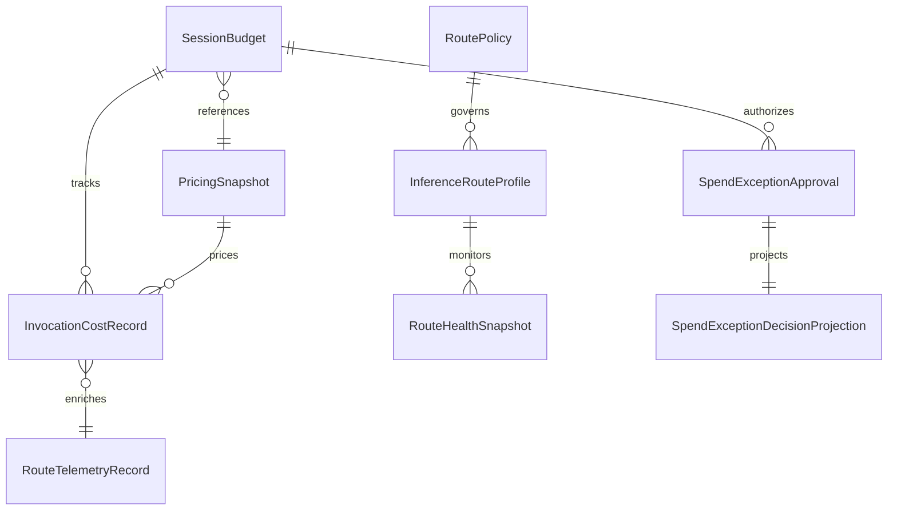

# Data Model: AI Gateway And Inference Economics

**Feature Branch**: `081-ai-gateway-economics` | **Date**: 2026-06-18

## Entity Overview

## 1. Session Budget Projection

**Rust type**: `SessionBudgetProjection` (new struct in `boundline-core/src/domain/inference_economics.rs`)

| Field | Type | Description |
|-------|------|-------------|
| `currency` | `Currency` (enum: Usd, Eur, ...) | Configured session currency, default USD |
| `budget_limit` | `Decimal` | Total approved budget in session currency |
| `known_spent` | `Decimal` | Sum of exact + estimated reconciled costs |
| `reserved` | `Decimal` | Sum of active pre-call reservations |
| `remaining_known_budget` | `Decimal` | budget_limit - known_spent - reserved |
| `unknown_cost_call_count` | `u32` | Count of calls with cost_quality=unknown |
| `pricing_snapshot_id` | `Option<String>` | Active snapshot identifier |
| `cost_basis` | `CostBasis` (enum: ExactOnly, Estimated, Mixed) | What the budget projection is based on |
| `budget_state` | `BudgetState` (enum: InBounds, ApproachingLimit, ApprovalRequired, Exhausted, Disabled) | Current budget enforcement state |
| `required_action` | `Option<RequiredAction>` | Action needed (ApproveUnknownCost, ApproveBudgetOverride, ...) |

**BudgetState variants**: `InBounds`, `ApproachingLimit` (within 10% of limit), `ApprovalRequired` (unknown cost or over-budget), `Exhausted`, `Disabled` (no budget configured).

## 2. Pricing Snapshot

**Rust type**: `PricingSnapshot` (new struct)

| Field | Type | Description |
|-------|------|-------------|
| `snapshot_id` | `String` | Unique versioned identifier |
| `schema_version` | `u32` | Schema version for forward compat |
| `effective_timestamp` | `DateTime<Utc>` | When this snapshot became effective |
| `source` | `String` | Provenance (operator-created, imported-from) |
| `entries` | `Vec<PricingEntry>` | Per-model pricing entries |

**PricingEntry**:

| Field | Type | Description |
|-------|------|-------------|
| `provider_id` | `String` | Provider identifier |
| `model_id` | `String` | Model identifier |
| `input_price_per_1k` | `Decimal` | Price per 1000 input tokens |
| `output_price_per_1k` | `Decimal` | Price per 1000 output tokens |
| `cached_input_price_per_1k` | `Option<Decimal>` | Cached prompt pricing |
| `native_currency` | `Currency` | Provider billing currency |
| `notes` | `Option<String>` | Operator notes |

**SnapshotState**: `Current`, `Stale` (age > threshold), `Missing` (no entry for model), `Invalid` (corrupt or unparseable).

## 3. Invocation Cost Record

**Rust type**: `InvocationCostRecord` (new struct)

| Field | Type | Description |
|-------|------|-------------|
| `call_id` | `Uuid` | Unique call identifier |
| `reservation_amount` | `Decimal` | Pre-call conservative estimate |
| `final_amount` | `Decimal` | Post-call reconciled amount |
| `native_currency` | `Option<Currency>` | Provider's billing currency |
| `normalized_currency` | `Currency` | Session currency |
| `conversion_source` | `Option<String>` | FX rate source |
| `conversion_timestamp` | `Option<DateTime<Utc>>` | When conversion was applied |
| `pricing_snapshot_id` | `String` | Snapshot used for reservation |
| `snapshot_age_at_reservation` | `Duration` | How old the snapshot was |
| `cost_quality` | `ReconciledCostQuality` | Post-call cost confidence |
| `reservation_confidence` | `ReservationCostQuality` | Pre-call estimate confidence |

**ReconciledCostQuality**: `Exact`, `Estimated`, `Unknown`, `LocalZeroMarginalCost`.

**ReservationCostQuality**: `CurrentEstimate`, `StaleEstimate`, `Unknown`.

## 4. Spend Exception Approval Record

**Rust type**: `SpendExceptionApprovalRecord` (new struct)

| Field | Type | Description |
|-------|------|-------------|
| `approval_id` | `Uuid` | Unique approval identifier |
| `approval_type` | `ApprovalType` | UnknownCostApproval or BudgetOverride |
| `approver_identity` | `String` | Who approved |
| `approver_role` | `ApproverRole` | SessionOwner or GovernanceApprover |
| `session_id` | `String` | Owning session |
| `execution_run_id` | `Option<String>` | Execution run reference |
| `provider_id` | `String` | Target provider |
| `model_id` | `String` | Target model |
| `route` | `String` | Selected route |
| `authority_zone` | `CanonAuthorityZone` | Zone of the task |
| `repository_egress` | `bool` | Whether content leaves local env |
| `approved_amount` | `Option<Decimal>` | Monetary ceiling |
| `scope` | `ApprovalScope` | SingleCall, BoundedTask, BoundedSession |
| `reason` | `String` | Operator-provided reason |
| `created_at` | `DateTime<Utc>` | Approval timestamp |
| `consumed_at` | `Option<DateTime<Utc>>` | When consumed |
| `expires_at` | `Option<DateTime<Utc>>` | Optional expiry |
| `state` | `ApprovalState` | Pending, Consumed, Expired, Revoked |

**ApprovalScope**: `SingleCall` (V1 default), `BoundedTask`, `BoundedSession`.

**ApprovalState**: `Pending`, `Consumed`, `Expired`, `Revoked`.

## 5. Spend Exception Decision Projection

**Rust type**: `SpendExceptionDecisionProjection` (new struct for CLI/status display)

| Field | Type | Description |
|-------|------|-------------|
| `approval_type` | `ApprovalType` | What kind of exception |
| `approval_state` | `ApprovalState` | Current state |
| `required_role` | `ApproverRole` | Who must approve |
| `authority_zone` | `CanonAuthorityZone` | Task zone |
| `repository_egress` | `bool` | Egress status |
| `requested_amount` | `Decimal` | Amount needed |
| `currency` | `Currency` | Session currency |
| `required_actions` | `Vec<String>` | List of actions operator must take |

## 6. Route Telemetry Record (extension)

**Existing type**: `StructuredRuntimeEvent` with `event_type = "provider.call.completed"`.

**Extended payload fields** (additive, same schema_version 1.0):
- `cost_quality`: `ReconciledCostQuality`
- `normalized_cost`: `Decimal`
- `native_cost`: `Option<Decimal>`
- `native_currency`: `Option<Currency>`
- `pricing_snapshot_id`: `String`
- `snapshot_staleness`: `Option<String>` ("current", "stale")
- `approval_type`: `Option<ApprovalType>`
- `approval_id`: `Option<Uuid>`

## 7. Storage Layout

All new types live in a new module: `boundline-core/src/domain/inference_economics.rs`.

Persistence strategy:
- **Session budget**: additive fields on `ActiveSessionRecord`, serialized to `.boundline/session.json`
- **Pricing snapshots**: stored in `[inference_economics.pricing_snapshots]` config section in `.boundline/config.toml`
- **Approval records**: stored as a `Vec<SpendExceptionApprovalRecord>` in `.boundline/session.json` under `ActiveSessionRecord.spend_exception_approvals`
- **Cost records**: stored as a `Vec<InvocationCostRecord>` in `.boundline/session.json` under `ActiveSessionRecord.invocation_cost_records`
- **Telemetry payloads**: embedded in existing `StructuredRuntimeEvent` payloads in `.boundline/traces/`
