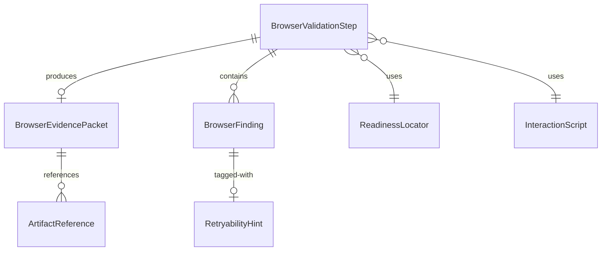

# Data Model: Browser And Visual Testing Provider

**Feature Branch**: `082-browser-visual-testing-provider` | **Date**: 2026-06-20

## Entity Overview

## 1. Browser Validation Step

**Rust type**: `BrowserValidationStep` (new struct in `boundline-core/src/domain/browser_provider.rs`)

| Field | Type | Description |
|-------|------|-------------|
| `validation_run_id` | `String` | Unique identifier for this run |
| `url` | `String` | Target page URL |
| `readiness` | `Option<ReadinessLocator>` | Optional page-ready condition |
| `interaction_script` | `Option<Vec<BrowserAction>>` | Optional scripted steps |
| `accessibility_enabled` | `bool` | Whether to run a11y audit |
| `dom_inspection` | `Option<DomInspectionConfig>` | Optional DOM capture config with `root_selector` and `max_depth` |
| `baseline_ref` | `Option<String>` | Optional visual baseline identifier |
| `timeouts` | `ValidationTimeouts` | Timeout configuration |
| `network_allowlist` | `Option<Vec<String>>` | Permitted outbound domains |
| `artifact_dir` | `String` | Session-scoped output directory |
| `session_id` | `String` | Owning session identifier |

## 2. Readiness Locator

**Rust type**: `ReadinessLocator` (new struct)

| Field | Type | Description |
|-------|------|-------------|
| `locator_type` | `LocatorType` | CSS selector, test_id, role, text |
| `locator_value` | `String` | The selector or identifier string |
| `expected_state` | `LocatorState` | attached, visible, hidden, detached |
| `timeout_seconds` | `u32` | Max wait duration |
| `stabilization_delay_ms` | `Option<u32>` | Optional post-match delay |

**LocatorType enum**: `CssSelector`, `TestId`, `AccessibleRole`, `Text`.

**LocatorState enum**: `Attached`, `Visible`, `Hidden`, `Detached`.

## 2a. DOM Inspection Config

**Rust type**: `DomInspectionConfig` (new struct)

| Field | Type | Description |
|-------|------|-------------|
| `root_selector` | `Option<String>` | CSS selector for root element; defaults to `body` |
| `max_depth` | `Option<u32>` | Maximum DOM tree depth; defaults to unlimited |

## 3. Interaction Script

**Rust type**: `InteractionScript` (new struct, wraps `Vec<BrowserAction>`)

| Field | Type | Description |
|-------|------|-------------|
| `steps` | `Vec<BrowserAction>` | Ordered action sequence |

**BrowserAction** variants (enum with payload):

| Variant | Payload |
|---------|---------|
| `Navigate` | `{ url, timeout_seconds }` |
| `Click` | `{ selector, timeout_seconds }` |
| `Type` | `{ selector, text, timeout_seconds }` |
| `Wait` | `{ selector_or_ms }` |
| `Screenshot` | `{ label }` |

## 4. Evidence Packet

**Rust type**: `BrowserEvidencePacket` (new struct)

| Field | Type | Description |
|-------|------|-------------|
| `validation_run_id` | `String` | Matching run identifier |
| `provider_id` | `String` | Provider that executed the step |
| `status` | `StepStatus` | completed, failed, timed_out, provider_error |
| `started_at` | `String` | ISO 8601 start timestamp |
| `completed_at` | `String` | ISO 8601 completion timestamp |
| `page_title` | `Option<String>` | Document title at capture time |
| `http_status` | `Option<u16>` | Final HTTP status code |
| `artifacts` | `Vec<ArtifactReference>` | Produced artifact files |
| `findings` | `Vec<BrowserFinding>` | Normalized findings |
| `timing` | `StepTiming` | Duration breakdown |
| `capabilities_active` | `Vec<String>` | Capabilities used during this step |
| `schema_version` | `u32` | Message schema version (1) |

**StepStatus enum**: `Completed`, `Failed`, `TimedOut`, `ProviderError`, `Cancelled`, `QueueTimeout`, `QueueFull`.

## 5. Artifact Reference

**Rust type**: `ArtifactReference` (new struct)

| Field | Type | Description |
|-------|------|-------------|
| `kind` | `ArtifactKind` | screenshot, console_log, network_log, dom_snapshot, accessibility_output, evidence_packet, diff_image |
| `relative_path` | `String` | Workspace-relative path |
| `content_hash` | `String` | SHA-256 hex |
| `media_type` | `String` | MIME type |
| `byte_size` | `u64` | Size in bytes |
| `created_at` | `String` | ISO 8601 creation timestamp |
| `retention_class` | `RetentionClass` | required_evidence, diagnostic, verbose, ephemeral |
| `validation_run_id` | `String` | Producing run |

**ArtifactKind enum**: `Screenshot`, `ConsoleLog`, `NetworkLog`, `DomSnapshot`, `AccessibilityOutput`, `EvidencePacket`, `DiffImage`.

**RetentionClass enum**: `RequiredEvidence`, `Diagnostic`, `Verbose`, `Ephemeral`.

## 6. Browser Finding

**Rust type**: `BrowserFinding` (new struct)

| Field | Type | Description |
|-------|------|-------------|
| `kind` | `FindingKind` | Finding category |
| `severity` | `FindingSeverity` | blocking, warning, info |
| `message` | `String` | Human-readable description |
| `evidence_refs` | `Vec<String>` | Artifact paths supporting this finding |
| `retryability` | `Option<RetryabilityHint>` | Advisory retry signal |
| `confirmed_intermittent` | `bool` | True after multiple inconsistent outcomes |

**FindingKind enum** (12 variants):
`ConsoleError`, `AccessibilityViolation`, `VisualDiffDetected`, `NetworkAccessViolation`, `PageLoadTimeout`, `BrowserReadinessTimeout`, `BaselineCreated`, `ScriptStepFailed`, `AccessibilityScanFailed`, `BrowserConcurrencyTimeout`, `BrowserQueueFull`, `CancelledBeforeStart`.

**FindingSeverity enum**: `Blocking`, `Warning`, `Info`.

## 7. Retryability Hint

**Rust type**: `RetryabilityHint` (new struct)

| Field | Type | Description |
|-------|------|-------------|
| `level` | `RetryabilityLevel` | not_indicated, possible, likely, unknown |
| `category` | `RetryabilityCategory` | Environmental condition |
| `reason` | `String` | Evidence for the hint |
| `timing_context` | `Option<StepTiming>` | Timing at hint observation |

**RetryabilityLevel enum**: `NotIndicated`, `Possible`, `Likely`, `Unknown`.

**RetryabilityCategory enum**: `NetworkTransient`, `ResourceContention`, `BrowserProcessFailure`, `ProviderUnavailable`, `QueueTimeout`, `EnvironmentStartupDelay`.

## 8. Step Timing

**Rust type**: `StepTiming` (new struct)

| Field | Type | Description |
|-------|------|-------------|
| `queue_wait_ms` | `Option<u64>` | Time spent in queue |
| `navigation_ms` | `Option<u64>` | Page navigation duration |
| `readiness_wait_ms` | `Option<u64>` | Readiness condition wait |
| `script_execution_ms` | `Option<u64>` | Interaction script duration |
| `accessibility_ms` | `Option<u64>` | Accessibility audit duration |
| `total_ms` | `u64` | Total step duration |

## 9. Validation Timeouts

**Rust type**: `ValidationTimeouts` (new struct)

| Field | Type | Description |
|-------|------|-------------|
| `page_load_seconds` | `u32` | Max page navigation time |
| `readiness_seconds` | `u32` | Max readiness condition wait |
| `script_step_seconds` | `u32` | Max per-script-step time |
| `execution_seconds` | `u32` | Overall execution ceiling |

## 10. Provider Configuration

**Rust type**: `BrowserProviderConfig` (new variant in existing provider types)

| Field | Type | Description |
|-------|------|-------------|
| `provider_id` | `String` | Stable identifier |
| `kind` | `String` | `"browser"` |
| `transport` | `String` | `"command"` |
| `command` | `String` | Executable path |
| `args` | `Vec<String>` | CLI arguments |
| `working_dir` | `Option<String>` | Working directory |
| `environment` | `EnvironmentInheritance` | Allowlist env vars |
| `startup_timeout_seconds` | `u32` | Provider start timeout |
| `enabled` | `bool` | Whether active |
| `max_concurrency` | `u32` | Max concurrent browser instances |
| `max_queue_size` | `u32` | Max queued requests |
| `queue_timeout_seconds` | `u32` | Per-request queue timeout |
| `execution_timeout_seconds` | `u32` | Per-step execution timeout |

**EnvironmentInheritance**: `{ inherit: Vec<String> }` — allowlist of env vars passed to the provider process.

## Glossary: Spec Terms → Rust Types

| Spec Term | Rust Type | Location |
|-----------|-----------|----------|
| Browser Validation Step | `BrowserValidationStep` | `browser_provider.rs` |
| Evidence Packet | `BrowserEvidencePacket` | `browser_provider.rs` |
| Browser Finding | `BrowserFinding` | `browser_provider.rs` |
| Interaction Script | `InteractionScript` (wraps `Vec<BrowserAction>`) | `browser_provider.rs` |
| Visual Baseline | Referenced by `baseline_ref: Option<String>` on `BrowserValidationStep` | `browser_provider.rs` |
| Network Permission Policy | `network_allowlist: Option<Vec<String>>` on `BrowserValidationStep` | `browser_provider.rs` |
| Concurrency Policy | `BrowserProviderConfig` fields (`max_concurrency`, `max_queue_size`, etc.) | `capability_provider.rs` |
| Readiness Locator | `ReadinessLocator` | `browser_provider.rs` |
| Artifact Reference | `ArtifactReference` | `browser_provider.rs` |
| Retryability Hint | `RetryabilityHint` | `browser_provider.rs` |
| Step Timing | `StepTiming` | `browser_provider.rs` |
| Validation Timeouts | `ValidationTimeouts` | `browser_provider.rs` |
| Step Status | `StepStatus` (enum: Completed, Failed, TimedOut, ProviderError, Cancelled, QueueTimeout, QueueFull) | `browser_provider.rs` |
| Finding Kind | `FindingKind` (enum: 12 variants) | `browser_provider.rs` |
| Finding Severity | `FindingSeverity` (enum: Blocking, Warning, Info) | `browser_provider.rs` |
| Retention Class | `RetentionClass` (enum: RequiredEvidence, Diagnostic, Verbose, Ephemeral) | `browser_provider.rs` |
